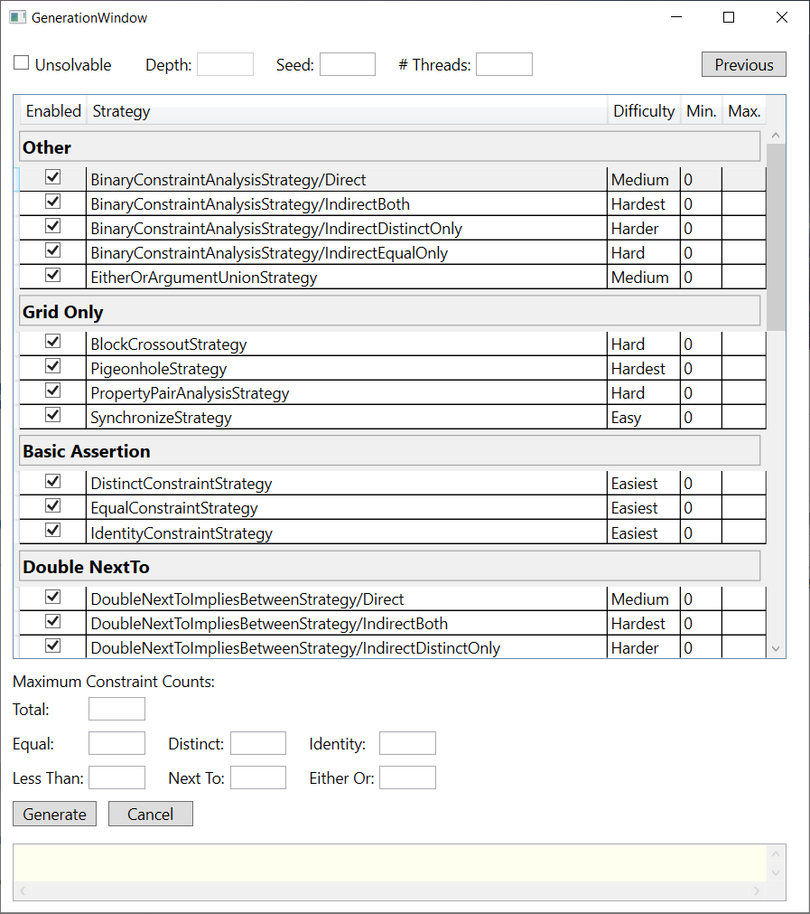

# *LogikGen* Logic Puzzle Generator

[Introduction](Introduction.md#logikgen-logic-puzzle-generator) - [Strategies](Strategies.md#logikgen-logic-puzzle-generator) - **Generation Settings**

# Generation Settings

## Table of Contents

- [Overview](#overview)
- [Heading](#heading)
- [Per-Strategy Settings](#per-strategy-settings)
- [Maximum Constraint Counts](#maximum-constraint-counts)
- [Interpreting the Output](#interpreting-the-output)
- [Suggested Settings](#suggested-settings)

## Overview

The *Generation* window of *LogikGen* contains many settings allowing you to fine-tune the resulting puzzle. 

It is perfectly fine to leave all settings on their default values, in which case the generator will create puzzles with no restrictions at all on the number of constraints or the types of strategies needed to solve them. Simply click the *Generate* button, wait 10 seconds, then click the *Cancel* button. The most difficult puzzle found within those 10 seconds will then be printed. 

The longer you leave *LogikGen* running, the more challenging the resulting puzzle will be. 

The purpose of each setting is discussed below. 

## Heading

- Unsolvable  
    Applies a brute-force search to find a puzzle that is guaranteed to have a unique solution, but which none of the strategies listed can solve. Such puzzles will require a "guess and check" approach to solve. Note that this is a great way to discover new strategies!
    
- Depth  
    If *Unsolvable* is checked, this controls the minimum number of levels of guess-and-check that will be required in order to solve the puzzle. No puzzle has been found yet, however, that requires a guess-and-check depth of 2 or more. Keeping this setting blank will improve running time, since analyzing a puzzle for its minimum guess-and-check depth is an expensive operation. 
    
- Seed  
    Seeds the random number generator used to search for random puzzles. This does not guarantee the same puzzle will result, however, since that also depends on when the Cancel button is clicked. This setting is mostly used to consistently test the generator.
    
- \#Threads  
    If left blank, the generator will use all available cores & hardware threads on your CPU. Use this to control the number of threads that will search in parallel for puzzles.
    
## Per-Strategy Settings

- Enabled  
    When unchecked, the selected strategy will not be used in the analysis of generated puzzles. No puzzle will require disabled strategies in order to solve. 
    
- Min  
    Makes the generator select only those puzzles which require a certain minimum number of applications of the selected strategy to solve. Increase this number to search for more difficult puzzles. 
    
- Max  
    Makes the generator select only those puzzles which require no more than the specified maximum number of applications of the selected strategy to solve. Suggest settings this to 1 for the hardest strategies, to ensure good fun puzzles that aren't insane.    

    **Setting `Max` to 0 is not the same as disabling the strategy!** It is common for a situation to arise where two different strategies could be applied to yield the same conclusions. The first strategy won't be counted as required if the second strategy could be used instead to solve the puzzle. Similarly, the second strategy won't be counted as required if the first could be used instead to solve the puzzle. 
    
    In other words, a puzzle may require at least one of the two strategies to solve, even if neither strategy on its own is required. In such a situation, disabling both strategies would cause the puzzle to be flagged as "unsolvable".
    
## Maximum Constraint Counts

Since *LogikGen* puzzles are random, it can often happen that the final puzzle it chooses contains nothing but *LessThan* constraints, or nothing but *EitherOr* constraints. Such puzzles aren't very fun. You can influence the proportion and amount of each type of constraint by setting their desired maximum counts.

- Total  
    The generator will only select puzzles which have no more than this number of constraints in total.
    
- Equal  
    The generator will only select puzzles which have no more than this number of `Equal` constraints. 
    
- Distinct  
    The generator will only select puzzles which have no more than this number of `Distinct` constraints. 
    
- Identity  
    The generator will only select puzzles which have no more than this number of `Identity` constraints. 

- Less Than  
    The generator will only select puzzles which have no more than this number of `LessThan` constraints
    
- Next To  
    The generator will only select puzzles which have no more than this number of `NextTo` constraints.
    
- Either Or  
    The generator will only select puzzles which have no more than this number of `EitherOr` constraints.

Leave these settings blank if you do not care to enforce any particular maximum.

## Interpreting the Output

[Sample Output](Files/SampleOutput.txt)

#### Satisfied vs. Unsatisfied

The first line of output will say either `[Satisfied]` or `[Unsatisfied]`. This refers to whether or not the puzzle described below satisfies all of the desired restrictions - the minimum/maximum number of applications for each enabled strategy and the maximum constraint counts. Once a puzzle is found that satisfies all restrictions, *LogikGen* no longer select puzzles that do not satisfy them. 

#### Constraints

Next we're given the list of constraints for the newly generated puzzle. In our sample output we have:

    6 total constraints.
    LessThan:Location(Blue, Norwegian)
    NextTo:Location(Spaniard, Red)
    Identity(Red, 2nd, Zebra, Norwegian)
    EitherOr(Englishman, Fox, Red)
    NextTo:Location(Norwegian, Blue)
    LessThan:Location(Green, Snails)

These can be written in plain English as:

1. The blue house is located somewhere to the left of the Norwegian.  
    `LessThan:Location(Blue, Norwegian)`
    
2. The Spaniard lives next to the red house.  
    `NextTo:Location(Spaniard, Red)`
    
3. The four people are: the man who lives in the red house, the man who lives in the 2nd house, the man who keeps the zebra, and the Norwegian.  
    `Identity(Red, 2nd, Zebra, Norwegian)`
    
4. The Englishman either keeps the fox, or lives in the red house.  
    `EitherOr(Englishman, Fox, Red)`
    
5. The Norwegian lives next to the blue house.  
    `NextTo:Location(Norwegian, Blue)`

6. The green house is located somewhere to the left of the man who keeps snails.  
    `LessThan:Location(Green, Snails)`

#### Minimum Applications

Next we're given a list of the minimum number of applications needed of each enabled strategy in order to solve the puzzle. This list is a bit misleading though, as described in [The Paradox of Too Many Strategies](Strategies.md#the-paradox-of-too-many-strategies). 

Reproduced here are some of the entries of the *Minimum Applications* list shown in the sample.

    [BinaryConstraintAnalysisStrategy/Direct: 0]
    [BinaryConstraintAnalysisStrategy/IndirectBoth: 0]
    etc...
    [EitherOrImpliesDistinctStrategy: 1]
    ...
    [IdentityConstraintStrategy: 1]
    ....
    [NextToCompatibilityCheckStrategy/General: 1]
    ...
    [NextToIncompatibilitySearchStrategy/General: 1]
    ...
    [PigeonholeStrategy: 0]
    [PropertyPairAnalysisStrategy: 0]
    [SynchronizeStrategy: 1]    

No matter how you approach this puzzle, you will be required to use, at minimum, the strategies [EitherOr Implies Distinct](Strategies/DistinctEquivalent.md), [Identity Constraint](Strategies/BasicAssertions.md#identity-constraint-strategy), The general variant of [NextTo Compatibility Check](Strategies/NextToCompatibilityCheckStrategy.md), the general variant of [NextTo Incompatibility Search](Strategies/NextToIncompatibilitySearchStrategy.md), and [Synchronize](Strategies/SynchronizeStrategy.md).

#### Solution

Next we're given the solution to our puzzle, both as a grid and a solution matrix. Our sample puzzle uses a rather unusually straight forward solution.

              |1234|ESUN|RGBY|DFZS|
    -------------------------------
    1st       |O...|O...|O...|O...|
    2nd       |.O..|.O..|.O..|.O..|
    3rd       |..O.|..O.|..O.|..O.|
    4th       |...O|...O|...O|...O|
    -------------------------------
    Englishman|O...|O...|O...|O...|
    Spaniard  |.O..|.O..|.O..|.O..|
    Ukrainian |..O.|..O.|..O.|..O.|
    Norwegian |...O|...O|...O|...O|
    -------------------------------
    Red       |O...|O...|O...|O...|
    Green     |.O..|.O..|.O..|.O..|
    Blue      |..O.|..O.|..O.|..O.|
    Yellow    |...O|...O|...O|...O|
    -------------------------------
    Dog       |O...|O...|O...|O...|
    Fox       |.O..|.O..|.O..|.O..|
    Zebra     |..O.|..O.|..O.|..O.|
    Snails    |...O|...O|...O|...O|
    -------------------------------

    -----------------------------------------------------
    |    1st     |    2nd     |    3rd     |    4th     |
    | Englishman |  Spaniard  | Ukrainian  | Norwegian  |
    |    Red     |   Green    |    Blue    |   Yellow   |
    |    Dog     |    Fox     |   Zebra    |   Snails   |
    -----------------------------------------------------

#### Deduction Log

Finally, we're given a log detailing which strategies can be applied in which order to arrive at the solution, including the state of the grid after every step.

## Suggested Settings

For a good fun puzzle that's moderately challenging but not too crazy, try the following settings:

- Number of Categories: 4
- Category Size: 4
- One ordered category. 

The built-in sample data is an excellent place to start. Bigger puzzles slow the generator substantially. 

- Randomize the solution.

- Disable all `Binary Constraint Analysis` variants.  
    This is a rather weird strategy and probably not ideal to start with.

- Disable all strategies within the `Constraint Generation` and `Compatibility Check` sections.  
    These, too, tend to be trickier to apply than most Zebra puzzles call for.

- Pigenhole Strategy - Min: 0, Max: 1.  
    This is a time-consuming strategy to recognize and apply, so you wouldn't want it to be required more than once. 

- Property Pair Analysis Strategy - Min: 2, Max: none (blank).  
    The puzzles you find in books tend to require this strategy pretty heavily. 
    
- Maximum Constraint Counts. These settings will ensure a decent variety without there being too many clues in total.  
    - Total: 8
    - Equal: 0
    - Distinct: 3
    - Identity: 1
    - Less Than: 3
    - Next To: 3
    - Either Or: 2

Let the generator run until it says all requirements have been `[Satisfied]`, after which you can click `Cancel`. This could require searching through as many as 20,000 puzzles, but on a reasonably fast desktop PC even that should take less than a minute. 

Save the output to a text file and enjoy your new puzzle. 

---

[Introduction](Introduction.md#logikgen-logic-puzzle-generator) - [Strategies](Strategies.md#logikgen-logic-puzzle-generator) - **Generation Settings**
