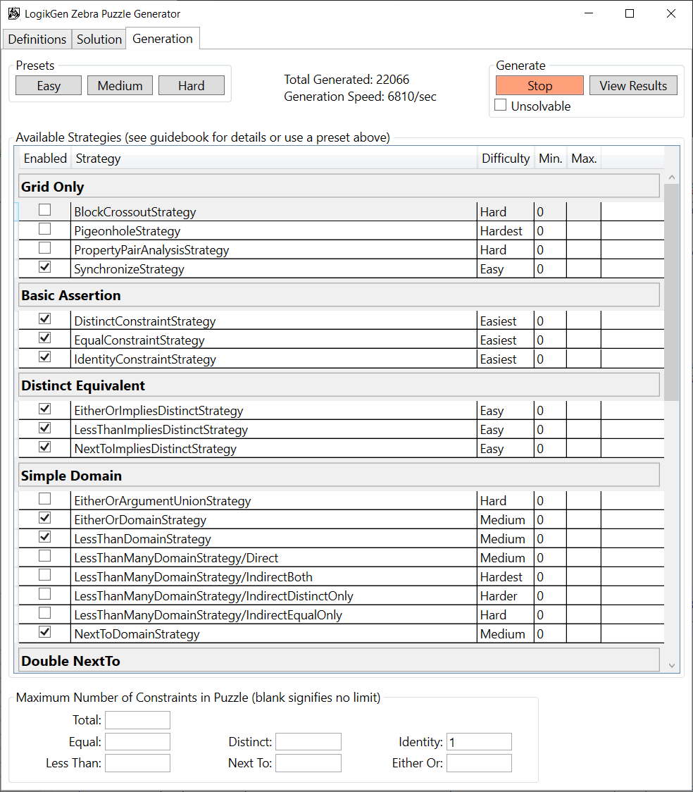

#  *LogikGen* Logic Puzzle Generator

**Introduction** - [Strategies](Strategies.md#logikgen-logic-puzzle-generator) - [Generation Settings](GenerationSettings.md#logikgen-logic-puzzle-generator)

# Introduction

## Table of contents
- [Overview](#overview)
- [What are Zebra puzzles?](#what-are-zebra-puzzles)
- [How to make Zebra puzzles?](#how-to-make-zebra-puzzles)

## Overview

LogikGen is a tool for creating randomized [Zebra-style logic puzzles](https://en.wikipedia.org/wiki/Zebra_Puzzle), where you control the difficulty by selecting which deduction strategies should be required in order to solve them.

LogikGen works by creating many completely random logic puzzles and then automatically solving them, while keeping track of which strategies were used. Every strategy has a difficulty rating assigned to it. Puzzles which require more applications of harder strategies are ranked higher than puzzles which require mostly easier stratgies. The hardest puzzle found will then be printed.

If the puzzles it finds are too hard, you can either deactivate or otherwise limit the more difficult strategies so that puzzles which go beyond those limits won't be printed.

You can also use LogikGen to find some truly devilishly difficult puzzles that are guaranteed to have a unique solution, but otherwise cannot be solved by any of the known strategies.

## What are Zebra puzzles?

The original Zebra puzzle appeared in *Life International* magazine, reproduced here as follows:

> 1. There are five houses.
> 2. The Englishman lives in the red house.
> 3. The Spaniard owns the dog.
> 4. Coffee is drunk in the green house.
> 5. The Ukrainian drinks tea.
> 6. The green house is immediately to the right of the ivory house.
> 7. The Old Gold smoker owns snails.
> 8. Kools are smoked in the yellow house.
> 9. Milk is drunk in the middle house.
> 10. The Norwegian lives in the first house.
> 11. The man who smokes Chesterfields lives in the house next to the man with the fox.
> 12. Kools are smoked in the house next to the house where the horse is kept.
> 13. The Lucky Strike smoker drinks orange juice.
> 14. The Japanese smokes Parliaments.
> 15. The Norwegian lives next to the blue house.
> 
> Now, who drinks water? Who owns the zebra?
> 
> In the interest of clarity, it must be added that each of the five houses is painted a different color, and their inhabitants are of different national extractions, own different pets, drink different beverages and smoke different brands of American cigarets [sic]. One other thing: in statement 6, right means your right.

— *Life International, December 17, 1962*  
    (quoted from https://en.wikipedia.org/wiki/Zebra_Puzzle)

These puzzles are traditionally solved using a grid like the one below:

  
**Figure 1 - Blank Zebra Grid**

To mark that two items are disassociated - for example, that the fox doesn't live in the same house as where Chesterfields are smoked - we place an `x` in the corresponding rows & columns. 

To mark that two items are associated - for example, that the Englishman lives in the red house - we place an `O` in the corresponding rows & columns, plus `x`s to indicate that nobody else lives in the red house, and that the Englishman doesn't live in any other color house.

The resulting grid is shown below:

  
**Figure 2 - A Few Facts Recorded**

The puzzle is completed when every cell of the grid is filled:

  
**Figure 3 - Completed Zebra Grid**

Final Solution:
- The Norwegian lives in the 1st house which is yellow. He drinks water, smokes Kools, and keeps a fox.
- The Ukrainian lives in the 2nd house which is blue. He drinks tea, smokes Chesterfield, and keeps a horse.
- The Englishman lives in the 3rd house which is red. He drinks milk, smokes Old Gold, and keeps snails.
- The Spaniard lives in the 4th house which is ivory. He drinks orange juice, smokes Lucky Strike, and keeps a dog.
- The Japanese lives in the 5th house which is green. He drinks coffee, smokes Parliament, and keeps a zebra.

## How to make Zebra puzzles?

Good zebra puzzles are quite difficult to engineer by hand. When inventing your own clues, it's virtually impossible to control the difficulty of the resulting puzzle by means other than just making it bigger. Over the decades, numerous techniques & strategies have been discovered for solving them. Some are relatively obvious and easy to apply, whereas others can be quite tricky. *LogikGen* was created in order to make good fun puzzles that required use of the harder strategies. 

Presented here is a quickstart guide just to help you begin. For a more in-depth explanation of all the different options, see the [Strategies](Strategies.md#logikgen-logic-puzzle-generator) and [Generation Settings](GenerationSettings.md#logikgen-logic-puzzle-generator) guides.

To generate a basic puzzle, follow the steps below:

### Step 1

Select the desired size of your puzzle and type in all of its categories and properties. Any categories marked as "Ordered" will have `LessThan` and `NextTo` constraints generated for them (e.g, *"The Norwegian lives next to the blue house"*).

  
**Figure 4 - Define Your Puzzle**

### Step 2

Select the desired final solution for the puzzle, or pick a randomized solution. 

  
**Figure 5 - Select the Desired Solution**

### Step 3

There are many available settings, the details of which can be reviewed in the [Generation Settings](GenerationSettings.md) and [Strategies](Strategies.md) guides. For now, just click the **Easy** preset followed by the **Start** button, wait a few seconds, then click the **Stop** button. The program will continually search for better & more difficult puzzles the longer you keep it running.

  
**Figure 6 - Puzzle Generation Settings**

  
**Figure 7 - The Generator is Running**

**Figure 8 - Puzzle Generation Complete**

*LogikGen* will use all available cores of your CPU to search for good puzzles. 

When the Cancel button is clicked, a great deal of information about your newly generated puzzle will be printed:

- The clues for your puzzle in *LogikGen*'s constraint notation. See the [Strategies](Strategies.md#terminology) guide for information about how to interpret these constraints.
- A listing of the minimum number of times each strategy must be applied in order to solve the puzzle, which is used for ranking its difficulty.
- A listing of the puzzle's categories and properties, needed for making a grid.
- The selected constraint & strategy settings.
- The puzzle's solution.
- A log of the detailed step-by-step deductions you can take to reach the solution.

---

**Introduction** - [Strategies](Strategies.md#logikgen-logic-puzzle-generator) - [Generation Settings](GenerationSettings.md#logikgen-logic-puzzle-generator)
