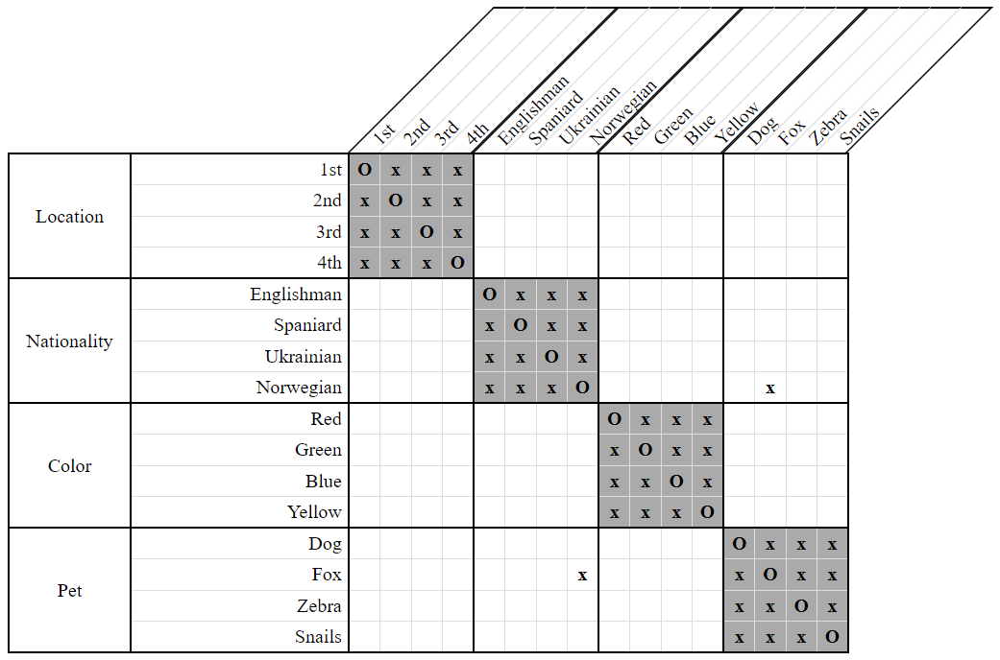

# Basic Assertions  

**Distinct, Equal, and Identity Constraints**

*LogikGen* uses strategies to record the relationships from *Distinct*, *Equal*, and *Identity* constraints even though no real deduction is required for them.

## Distinct Constraint Strategy

For every `Distinct` constraint, a disassociation (`x`) will be recorded on the grid. For example,

- The Norwegian does not keep foxes.  
    `Distinct(Norwegian, Fox)`

will be recorded as:

  
**Figure 1**

## Equal Constraint Strategy

For every `Equal` constraint, an association (`O`) will be recorded on the grid. For example, 

- The owner of the blue house keeps the zebra.  
    `Equal(Blue, Zebra)`
    
will be recorded as:

  
**Figure 2**

Notice the corresponding disassociations (`x`) are also recorded automatically. The owner of the blue house doesn't own any other pet, and the zebra doesn't live in any other color house.

## Identity Constraint Strategy

For every `Identity` constraint, all corresponding disassociations (`x`) will be recorded on the grid. For example,

- There are four people: the Englishman, the owner of the green house, the man who lives in the third house, and the man who keeps snails.  
    `Identity(Englishman, Green, 3rd, Snails)`

will be recorded as:

  
**Figure 3**

Notice that an `Identity` constraint is merely a shorthand for several `Distinct` constraints. The above clue could easily have been interpreted instead as:

- `Distinct(Englishman, Green)`
- `Distinct(Englishman, 3rd)`
- `Distinct(Englishman, Snails)`
- `Distinct(Green, 3rd)`
- `Distinct(Green, Snails)`
- `Distinct(3rd, Snails)`

but explicit `Identity` constraints are more convenient. 

