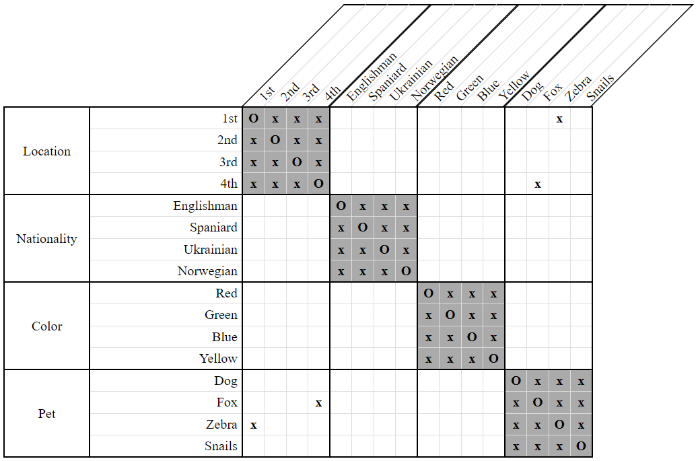
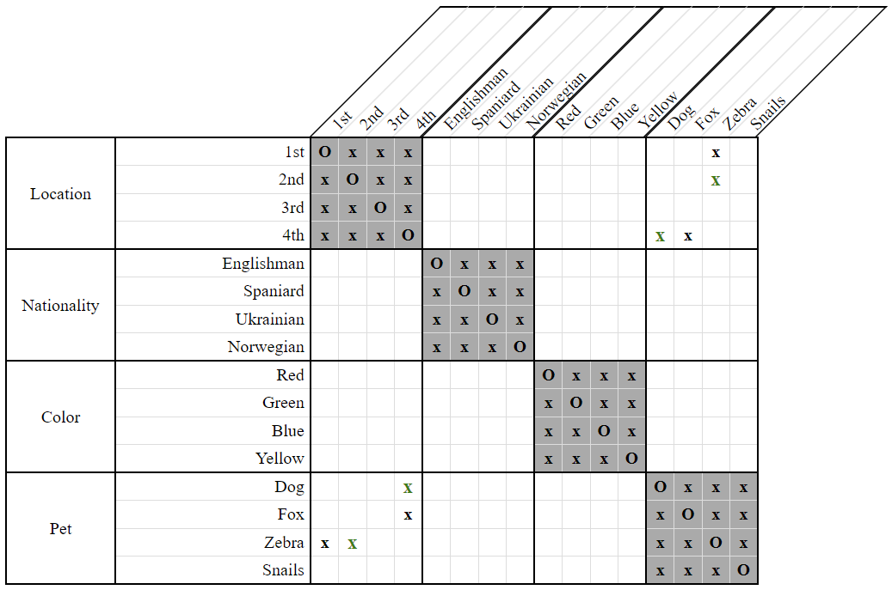

# Binary Constraint Analysis Strategy

*Binary Constraint Analysis* is the most obscure of all *LogikGen* strategies and certainly the most difficult to apply. It employs a mathematical "set theory" approach toward clues involving certain patterns of `LessThan` and/or `NextTo` constraints.

If your goal is simply to create a good fun logic puzzle, it's probably best to disable this strategy altogether. If your goal is to delve deep into the murky endless rabbit hole of obscure puzzle solving strategies, then read on, but be forewarned: here be dragons!

*Binary Constraint Analysis* applies whenever we have constraints of the form:

- `R1(A, X1) & R2(X2, B)`

where

- `R1` and `R2` represent any combination of constraints over two properties. 
- `X1` and `X2` are any two associated properties.
- `A` and `B` are any two disassociated properties.

Given this, we employ three separate processes, which I will call *A-First*, *B-First*, and *X-First* respectively. 

#### <u> A-First </u> ####

Let `apos` denote an available position for property `A`.

Let `Sx` denote the set of available positions for property `X1` under the constraint `R1(A, X1)` for `A = apos`. 

Let `Sb` denote the set of available positions for property `B` under the constraint `R2(X2, B)` for all `X2 ∈ Sx`.

If either `Sb = ∅` or `Sb = {apos}`, then we can assert that `apos` is not a valid position for `A`.

#### <u> B-First </u> ####

This is just the reverse of the *A-First* approach.

Let `bpos` denote an available position for property `B`.

Let `Sx` denote the set of available positions for property `X2` under the constraint `R2(X2, B)` for `B = bpos`. 

Let `Sa` denote the set of available positions for property `A` under the constraint `R1(A, X1)` for all `X1 ∈ Sx`.

If either `Sa = ∅` or `Sa = {bpos}`, then we can assert that `bpos` is not a valid position for `B`.

#### <u> X-First </u> ####

Let `xpos` denote an available position for property `X`.

Let `Sa` denote the set of available positions for property `A` under the constraint `R1(A, X1)` for `X1 = xpos`.

Let `Sb` denote the set of available positions for property `B` under the constraint `R2(X2, B)` for `X2 = xpos`.

If `Sa` and `Sb` are both singleton sets such that `Sa = Sb`, then we can assert that `xpos` is not a valid position for `X`.

## Example

*Binary Constraint Analysis* is an extremely general-purpose strategy which can apply to any pair of constraints over two properties. If, in the future, another two-property constraint type gets added to *LogikGen* beyond merely `LessThan` and `NextTo`, *Binary Constraint Analysis* would apply equally well to it.

Being so general, it is often able to deduce the same information as other strategies. The following example may seem rather simple given the generalized mathematical description above, but it's nonetheless a good place to start.

Consider the following clues and grid:

- The dog lives next to the fox.  
    `NextTo(Dog, Fox)`

- The fox lives somewhere to the left of the zebra.  
    `LessThan(Fox, Zebra)`

  
**Figure 1**

Initially, all positions are available to the dog. To perform *Binary Constraint Analysis* we'll need to look at each of them, one by one. When we get to the 4th position, we notice something interesting.

Let `dog_pos` denote the 4th position.

Let `S_fox` denote the set of available positions for the fox under the constraint `NextTo(Dog, Fox)` when the dog is at the 4th position. This gives us `S_fox = {3rd}`.

Let `S_zebra` denote the set of available positions for the zebra under the constraint `LessThan(Fox, Zebra)` considering only those fox positions in `S_fox`. This gives us `S_zebra = {4th}`.

This shows that if we attempt to place the dog into the 4th position, the zebra will get forced into the same position as the dog - a contradiction! 

Therefore, the dog cannot be placed in the 4th house.

I'll leave it as an exercise for you to prove why the zebra cannot be placed into the 2nd house, since that deduction works the same way.

  
**Figure 2**

## Variants

As with other strategies, *Binary Constraint Analysis* has several variants which dictate the kinds of clues that will be considered.

- Direct  

    The *Direct* variant is the easiest to use, but the least powerful. It recognizes only constraints of the form `R1(A, X) & R2(X, B)` where `A` and `B` are distinct properties which lie within the same category. This is the variant illustrated in our example above.

- Indirect / Equal Only

    The *Indirect / Equal Only* variant recognizes constraints of the form `R1(A, X1) & R2(X2, B)` where `X1` and `X2` can either be the same property, or two different but associated properties. The properties `A` and `B` must still be distinct and lie within the same category. An example of this would be the clues:

    - The dog lives next to the Spaniard.  
        `NextTo(Dog, Spaniard)`

    - The green house is located somewhere to the left of the zebra.  
        `LessThan(Green, Zebra)`    

    If it is already known that the Spaniard lives in the green house and keeps the fox, then these clues are equivalent to `NextTo(Dog, Fox) & LessThan(Fox, Zebra)` from our example above.

- Indirect / Distinct Only

    The *Indirect / Distinct Only* variant recognizes constraints of the form `R1(A, X) & R2(X, B)` where `A` and `B` are disassociated properties of possibly different categories. An example of this would be the clues:
    
    - The Englishman lives next to the fox.  
        `NextTo(Englishman, Fox)`

    - The fox lives somewhere to the left of the blue house.  
        `LessThan(Fox, Blue)`
    
    If it is already known that the Englishman doesn't live in the blue house, then we can employ a similar deduction as our example above to prove that the Englishman cannot live in the 4th house and that the blue house cannot be the 2nd one.
    

- Indirect / Both

    The *Indirect / Both* variant is a combination of *Indirect / Equal Only* and *Indirect / Distinct Only* and recognizes constraints of the most general form - `R1(A, X1) & R2(X2, B)` where `X1` and `X2` may be of different categories as long as they're associated, and where `A` and `B` likewise may be of different categories as long as they're disassociated. An example of this would be the clues:
    
    - The Englishman lives next to the fox.  
        `NextTo(Englishman, Fox)`

    - The green house is located to the left of the blue house.  
        `LessThan(Green, Blue)`    
    
    If it is already known that the Englishman doesn't live in the blue house, but also that the fox lives in the green house, then these clues are equivalent to those listed for the *Indirect / Distinct Only* variant.

