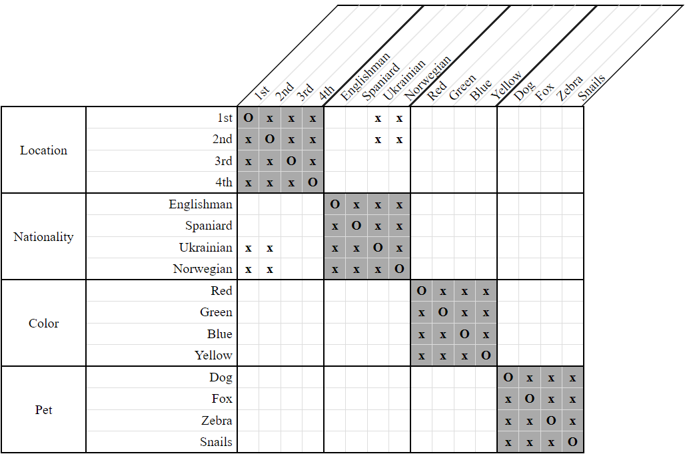
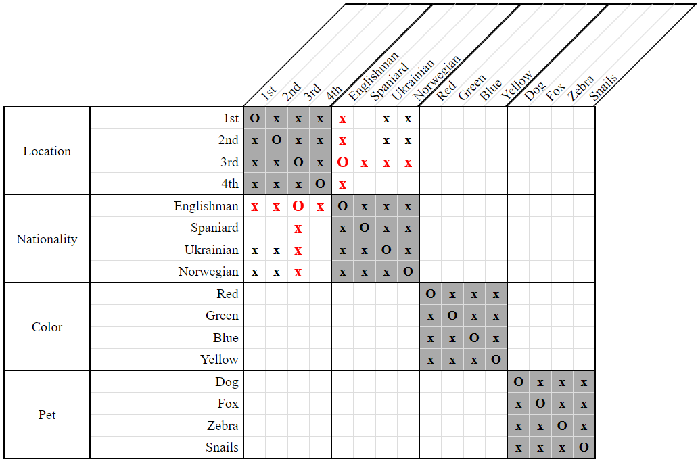
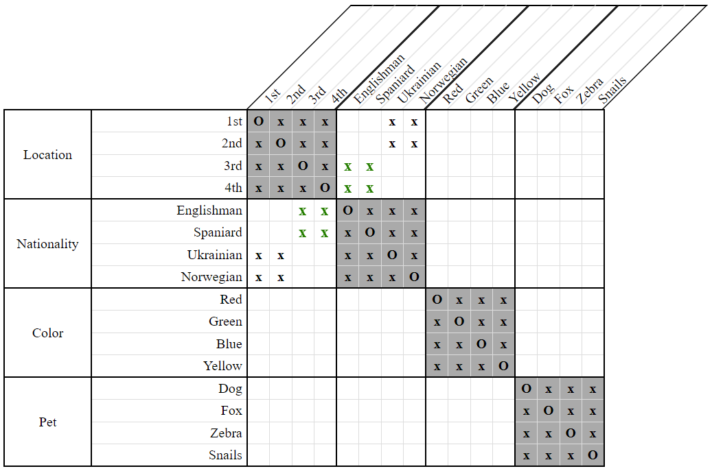

# Block Crossout Strategy

*Block Crossout* is a grid-only technique of deducing new relationships according to a particular grid pattern. This pattern is illustrated in the example below.

  
**Figure 1**

Here, we see that the 3rd and 4th houses must be reserved exclusively for the Ukrainian and the Norwegian. It is impossible for the Englishman or the Spaniard to live in either of these houses. If we attempt to put the Englishman into the 3rd house, for example, we'd arrive at the following contradiction:

  
**Figure 2**

Notice that in this situation, both the Ukrainian and the Norwegian would have to squeeze together into the 4th house. This isn't allowed. 

We can therefore conclude that neither the Englishman nor the Spaniard can live in the 3rd or 4th houses.

  
**Figure 3**
