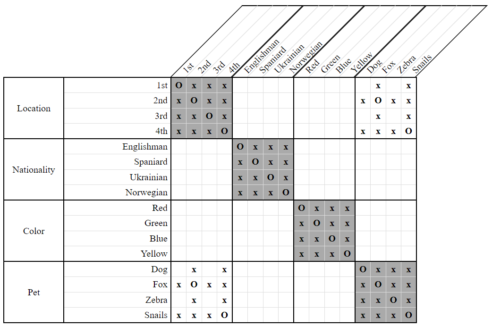
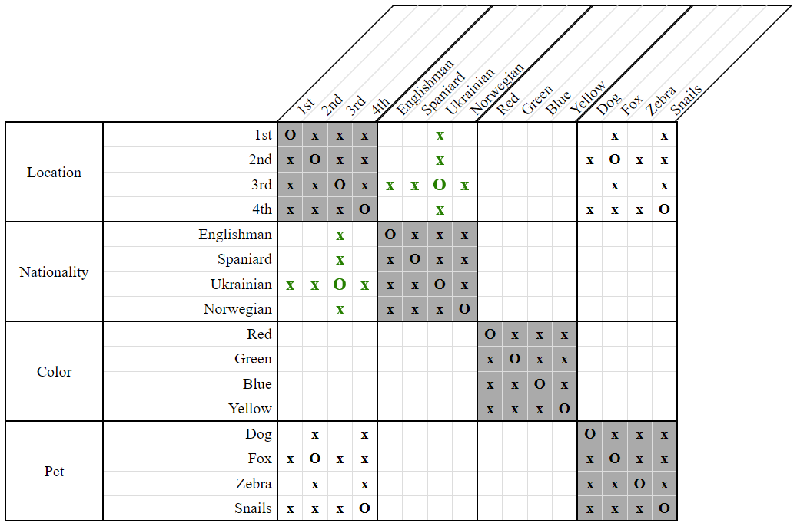
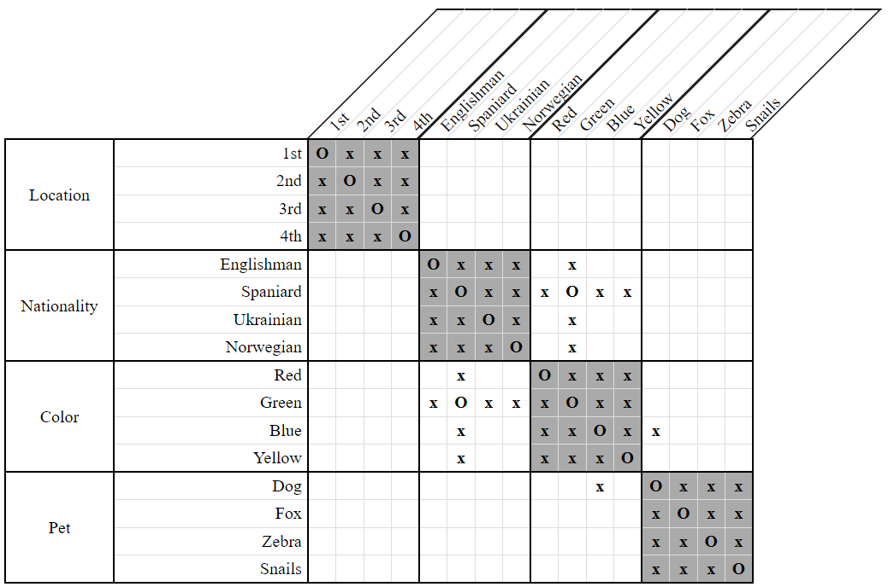
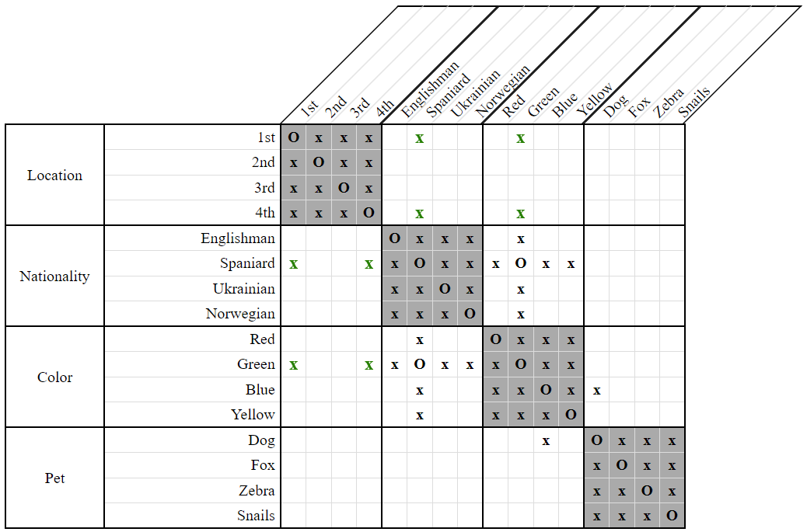

# Double NextTo Implies Between Strategy

Whenever we have two constraints of the form `NextTo(A, X) & NextTo(X, B)`, where `A` and `B` refer to two distinct entities, then it must be the case that the position of `X` lies exactly in between the positions of `A` and `B`. Note that the order of the properties within a `NextTo` constraint is arbitrary. `NextTo(X, Y)` is considered identical to `NextTo(Y, X)`.

As an example, consider the following clues and grid:

- The Ukrainian lives next to the man who keeps the fox.  
    `NextTo(Ukrainian, Fox)`
    
- The Ukrainian lives next to the man who keeps snails.  
    `NextTo(Ukrainian, Snails)`
    
  
**Figure 1**    

In the grid above, we see that the fox owner lives in the second house while the snails owner lives in the fourth house. The only way that the Ukrainian can live next to both of them is if he lives in the third house.

  
**Figure 2**

This was a particularly simplistic application of the *Double NextTo Implies Between Strategy*. The following clues and grid illustrate a much trickier example:

- The Spaniard lives next to the blue house.  
    `NextTo(Spaniard, Blue)`

- The dog owner lives next to the green house.  
    `NextTo(Dog, Green)`
    
  
**Figure 3**

This grid shows that the dog owner is a separate person from whoever lives in the blue house, while it's the Spaniard who lives in the green house.

Our clues therefore tell us that the Spaniard lives in between two other people. We don't know anybody's location though, so how is that information useful?

While we cannot pinpoint the Spaniard's exact location like we did for the Ukrainian in our first example, we can at least eliminate some possibilities. Namely, the Spaniard can live at neither the `1st` location nor the `4th` since those locations are adjacent to only one house whereas the Spaniard is adjacent to two.

  
**Figure 4**

## Variants

As our examples have shown, it may be harder in some puzzles to see when *Double NextTo Implies Between* might apply compared to other puzzles. When the Ukrainain lives next to both the fox owner and the snails owner, it's plainly obvious that he lives between two people. When the Spaniard lives next to the blue house and the dog owner lives next to the green house, it gets a fair bit more complicated to see how that implies the Spaniard lives between two people.

Listed below are the four variants of this strategy in order of increasing difficulty. The primary difference between them is the technique used to select which pair of `NextTo` constraints to consider.

* Direct  

    This variant considers only constraints of the form `NextTo(X, A1) & NextTo(X, A2)`, where properties `A1` and `A2` lie within the same category. It is what was illustrated in our first example with `NextTo(Ukrainian, Fox) & NextTo(Ukrainian, Snails)`.

* Indirect / Equal Only  

    This variant considers constraints of the form `NextTo(X, A1) & NextTo(Y, A2)`, where properties `A1` and `A2` lie within the same category, but properties `X` and `Y` are from separate categories and associated.
    
    An example of the constraints considered would be `NextTo(Ukrainian, Fox) & NextTo(Blue, Snails)`, where it is already known that the Ukrainian lives in the blue house.

* Indirect / Distinct Only  

    This variant considers constraints of the form `NextTo(X, A) & NextTo(X, B)`, where properties `A` and `B` are from separate categories and disassociated.
    
    An example of the constraints considered would be `NextTo(Spaniard, Blue) & NextTo(Spaniard, Dog)`, where it is already known that the dog doesn't live in the blue house.

* Indirect / Both

    This variant is a combination of *Equal Only* and *Distinct Only*. It considers constraints of the form `NextTo(X, A) & NextTo(Y, B)`, where properties `X` and `Y` are from separate categories and associated, while properties `A` and `B` are also from separate categories but disassociated. It is what was illustrated in our second example with `NextTo(Spaniard, Blue) & NextTo(Dog, Green)`.
    
