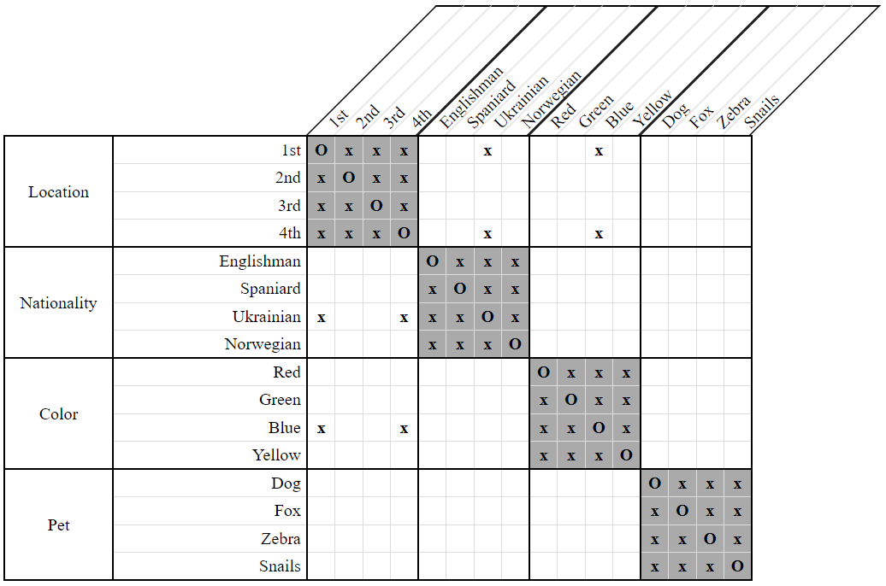
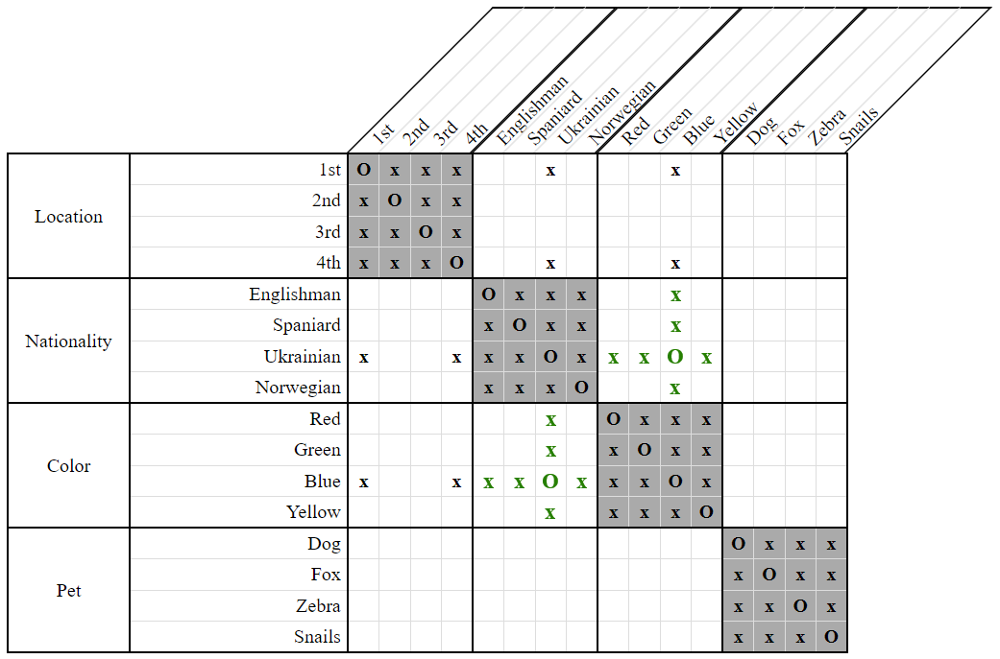

# Double NextTo Implies Equal Strategy

Whenever we have two constraints of the form `NextTo(X, A) & NextTo(X, B)` where there are no positions available for `X` to go between `A` and `B`, then it must be the case that `A` and `B` are associated.

As an example, consider the following clues and grid: 

- The Norwegian lives next to the Ukrainian.  
    `NextTo(Norwegian, Ukrainian)`
    
- The Norwegian lives next to the blue house.  
    `NextTo(Norwegian, Blue)`
    
  
**Figure 1**

We see in the above grid that the only possible locations for the Ukrainian are `1st` and `2nd`, same as for the blue house. If the Ukrainian and the man living in the blue house were different people, how could the Norwegian live next to both of them? 

He would have to live in between them, but this is not possible. There simply aren't enough locations available for the Norwegian to be nestled in between the blue house and the Ukrainian. Therefore, the Ukrainian and the man living in the blue house must be the same person!

  
**Figure 2**

## Variants

Like with [Double NextTo Implies Between](DoubleNextToImpliesBetweenStrategy.md), there are multiple variants of *Double NextTo Implies Equal*. However, since this strategy does not rely on any disassociated properties, there are no *Distinct Only* or *Both* variants. 

* Direct

    This variant considers only constraints of the form `NextTo(X, A) & NextTo(X, B)` and is what was illustrated in our example with `NextTo(Norwegian, Ukrainian) & NextTo(Norwegian, Blue)`.

* Indirect (Equal Only)

    This variant considers constraints of the form `NextTo(X, A) & NextTo(Y, B)` where properties `X` and `Y` are from separate categories and associated.
    
    An example of the constraints considered would be `NextTo(Norwegian, Ukrainian) & NextTo(Snails, Blue)`, where it is already known that the Norwegian is the one who keeps snails.
