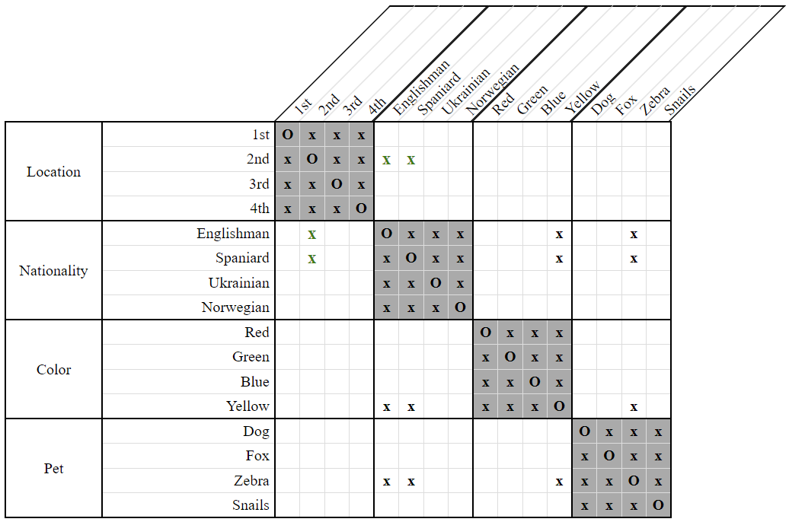

# EitherOr Argument Union Strategy

*EitherOr Argument Union* is a relatively straight-forward method of analyzing `EitherOr` constraints. In short, when given the constraint `EitherOr(X, A, B)` we can immediately conclude that whatever is true for both `A` and `B` must also be true for `X`. As an example, consider the follwing clue and grid:

- The 2nd house is either the yellow one, or the one where the zebra lives.  
    `EitherOr(2nd, Yellow, Zebra)`
    
  
**Figure 1**

The Englishman neither lives in the yellow house, nor keeps the zebra. Since those are the only possibilities for the 2nd house, it must be that the Englishman doesn't live in the 2nd house.

The Spaniard likewise neither lives in the yellow house, nor keeps the zebra. Thus, for the same reason he can't live in the 2nd house either.

  
**Figure 2**
