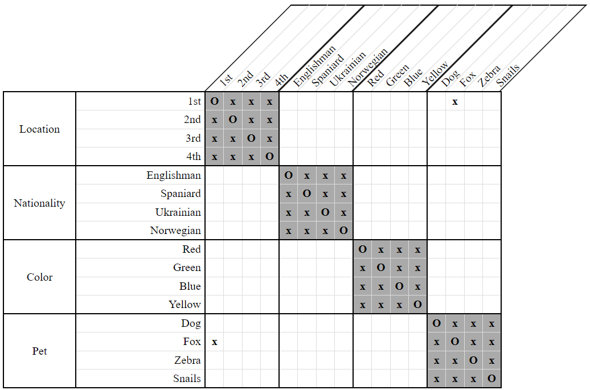
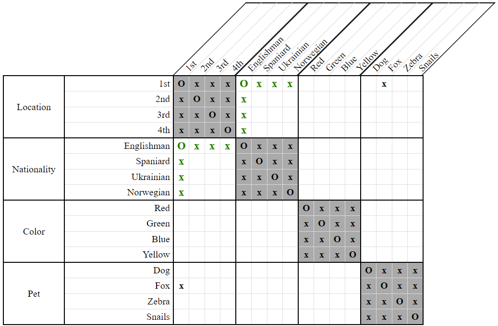

# EitherOr Domain Strategy

The *EitherOr Domain Strategy* captures the basic, intuitive meaning of `EitherOr` constraints. 

Specifically, when we're given `EitherOr(A, X, Y)`, if `A` has previously been disassociated from `X` then we can associate `A` with `Y`. Simlarly, if `A` has previously been disassociated from `Y` then we can associate `A` with `X`.

As an example, consider the following clue and grid:

- The first house either belongs to the Englishman, or to the man who keeps the fox.  
    `EitherOr(1st, Englishman, Fox)`
    
  
**Figure 1**

In this grid, we see that the first house does not belong to the man who keeps the fox. We may therefore conclude that the first house belongs to the Englishman.

  
**Figure 2**
