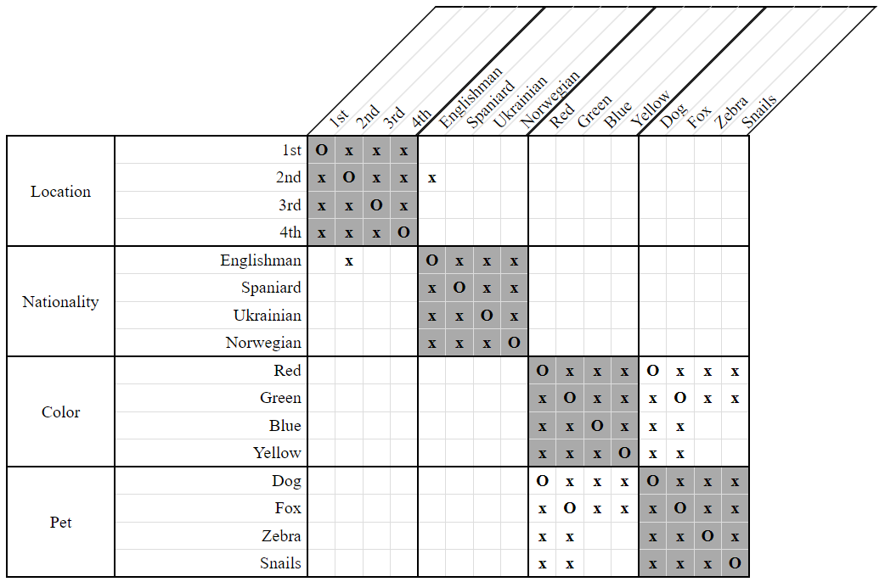

# Generation Strategies 

Not all important information can be recorded on the grid. With particularly challenging puzzles, it can sometimes be helpful to write down our deductions as additional clues to which we can apply our other strategies.

This is the purpose of the *constraint generation* strategies. They take the existing constraints of our puzzle and transform them into different, albeit equivalent constraints that other strategies might be able to make better use of. 

*LogikGen* currently has three such strategies: [LessThan Transitive Constraint Generation](LessThanTransitiveConstraintGenerationStrategy.md), [EitherOr Transitive Constraint Generation](EitherOrTransitiveConstraintGenerationStrategy.md), and [LessThan/NextTo Transitive Constraint Generation](LessThanNextToTransitiveConstraintGenerationStrategy.md).

## EitherOr Transitive Constraint Generation Strategy

This strategy takes the same reasoning used in the [LessThan Transitive Constraint Generation Strategy](LessThanTransitiveConstraintGenerationStrategy.md) and applies it to *EitherOr* constraints.

Whenever we have two constraints of the form `EitherOr(X, A, B) & EitherOr(Y, A, B)` where it is known that `X` and `Y` are disassociated, we can immediately conclude both `EitherOr(A, X, Y)` and `EitherOr(B, X, Y)`. As an example, consider the clues:

- The Englishman either lives in the red house, or keeps foxes.  
    `EitherOr(Englishman, Red, Fox)`
    
- The Spaniard either lives in the red house, or keeps foxes.  
    `EitherOr(Spaniard, Red, Fox)`

Given these clues, if we tried to give the red house to anyone other than the Englishman or the Spaniard, we'd get a contradiction. If the Englishman doesn't live in the red house, then he'd have to keep foxes. Likewise, if the Spaniard also doesn't live in the red house, then he too would also have to keep foxes - a situation not allowed in `Zebra` puzzles.

The red house must belong to one of these two people. The same reasoning tells us that foxes likewise must be kept by one of these two people. 

Therefore, from these we can generate the clues:

- The red house belongs to either the Englishman or to the Spaniard.  
    `EitherOr(Red, Englishman, Spaniard)`
    
- Foxes are kept by either the Englishman or the Spaniard.  
    `EitherOr(Fox, Englishman, Spaniard)`
    
Other *LogikGen* strategies will then be able to make use of these new clues.    
    
### Variants

There are four variants of the *EitherOr Transitive Constraint Generation Strategy*, differing only by how the two initial `EitherOr` constraints are matched up.

- Direct

    The example above illustrates only the easiest, least powerful *Direct* variant, which recognizes only constraints of the form `EitherOr(X, A, B) & EitherOr(Y, A, B)` where `X` and `Y` are distinct properties of the same category.

- Indirect (Equal Only)

    This variant recognizes constraints of the form `EitherOr(X, A1, B1) & EitherOr(Y, A2, B2)` where `A1` is associated with `A2`, `B1` is associated with `B2`, and where `X` and `Y` are distinct properties of the same category. As an example, consider the clues:

    - The Englishman either lives in the red house, or keeps foxes.  
        `EitherOr(Englishman, Red, Fox)`
        
    - The Spaniard either keeps dogs, or lives in the green house.  
        `EitherOr(Spaniard, Dog, Green)`
        
    If it is known that the dogs live in the red house and also that the foxes lives in the green house, then these clues are equivalent to the original example and so we can immediately conclude:
    
    - The red house, in which the dogs live, belongs to either the Englishman or to the Spaniard.  
        `EitherOr(Red, Englishman, Spaniard)` or `EitherOr(Dogs, Englishman, Spaniard)`
        
    - The green house, in which the foxes live, belongs to either the Englishman or the Spaniard.  
        `EitherOr(Green, Englishman, Spaniard)` or `EitherOr(Foxes, Englishman, Spaniard)`

- Indirect (Distinct Only)

    This variant recognizes constraints of the form `EitherOr(X, A, B) & EitherOr(Y, A, B)` where `X` and `Y` may be from different categories and the grid is used to detect whether they have been disassociated. As an example, consider the clues:
    
    - The Englishman either lives in the red house, or keeps foxes.  
        `EitherOr(Englishman, Red, Fox)`
        
    - The 2nd house is either the red one, or the one where foxes are kept.  
        `EitherOr(2nd, Red, Fox)`
        
    If it is known that the Englishman isn't the one who lives in the 2nd house, then we can immediately conclude:
    
    - The red house is either the 2nd one, or the one where the Englishman lives.  
        `EitherOr(Red, 2nd, Englishman)`
        
    - The foxes are kept in either the 2nd house, or the one where the Englishman lives.  
        `EitherOr(Fox, 2nd, Englishman)`

- Indirect (Both)

    This variant is a combination of both *Indirect (Equal Only)* and *Indirect (Distinct Only)* and can recognize even the most generalized constraints of the form `EitherOr(X, A1, B1) & EitherOr(Y, A2, B2)` where `A1` is associated with `A2`, `B1` is associated with `B2`, and where `X` and `Y` are disassociated properties from potentially different categories. As an example, consider the clues and grid:
    
    - The Englishman either lives in the red house, or keeps foxes.  
        `EitherOr(Englishman, Red, Fox)`
        
    - The 2nd house is either the green one, or the one where dogs are kept.  
        `EitherOr(2nd, Green, Dog)`

      
    **Figure 1**

    In particular, if we already know that the dogs are kept in the red house, the foxes are kept in the green house, and the Englishman does not live in the second house, then we can immediately conclude:
    
    - The red house, in which the dogs are kept, belongs to either the Englishman or to the owner of the 2nd house.  
        `EitherOr(Red, Englishman, 2nd)` or `EitherOr(Dogs, Englishman, 2nd)`
        
    - The green house, in which the foxes are kept, belongs to either the Englishman or to the owner of the 2nd house.  
        `EitherOr(Green, Englishman, 2nd)` or `EitherOr(Foxes, Englishman, 2nd)`
    

