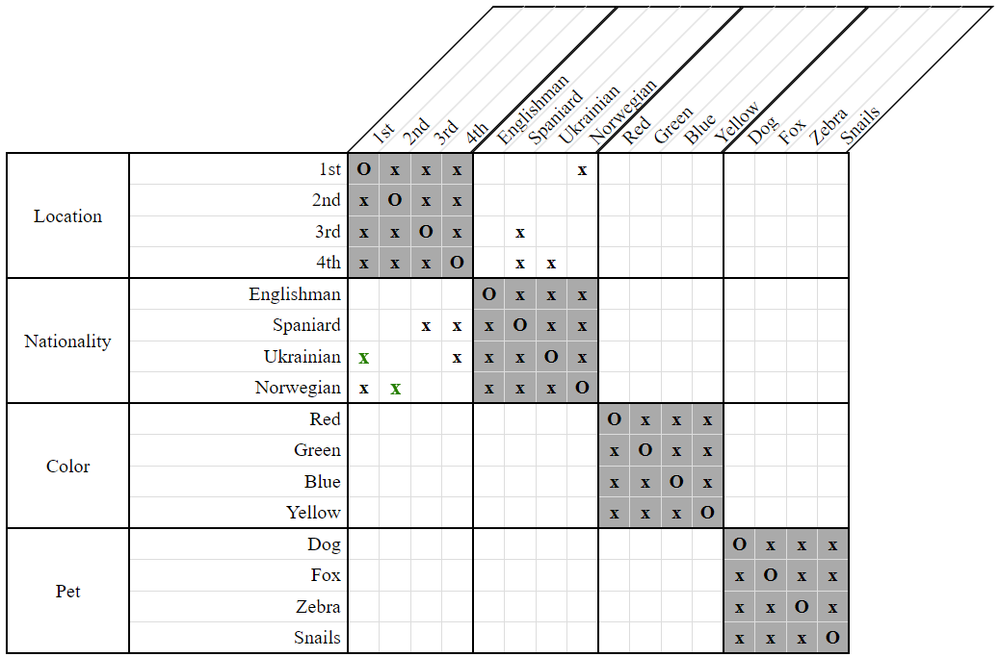
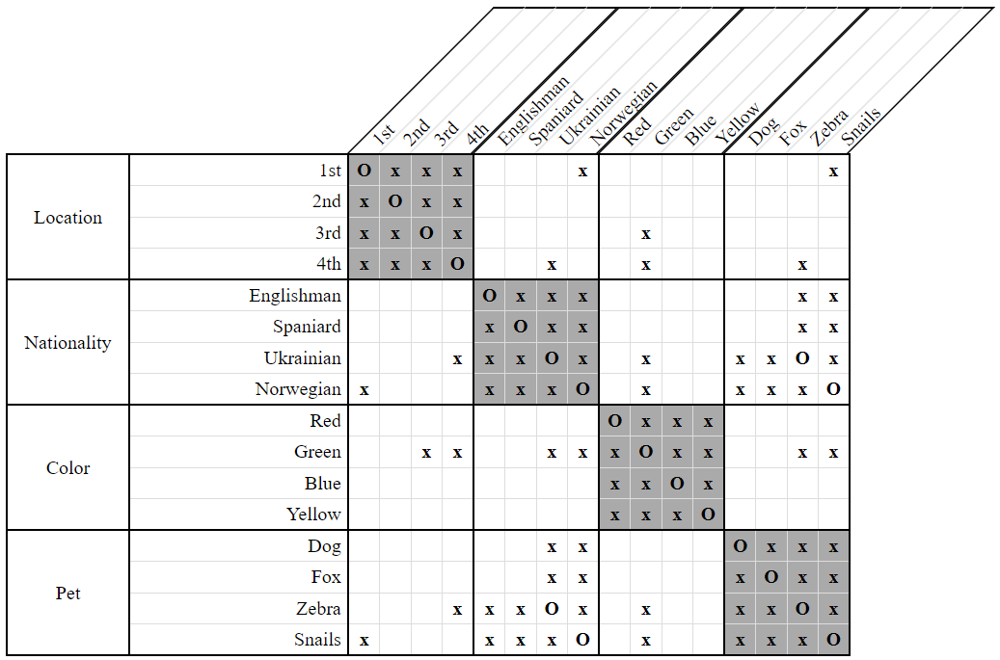

# Immediate LessThan Compatibility Check Strategy

The *compatibility check* strategies are among the most difficult ones to use, but they are all based on the same general idea. Given two properties `X` and `Y`, we look at all the different combinations of positions that could be assigned to them. For each combination, we check whether it would cause another property `Z` to have no positions left available to it. If such a property `Z` exists, we disassociate the corresponding combination of positions from the properties `X` and/or `Y`.

The main difference between these strategies are the types of constraints examined, since they dictate which combinations of positions need to be considered. The *Immediate LessThan Compatibility Check Strategy* specifically looks at constraints of the form `LessThan(X, Y) & NextTo(X, Y)`.

Consider the following clue and grid:

- The Ukrainian lives immediately to the left of the Norwegian.  
    `LessThan(Ukrainian, Norwegian) & NextTo(Ukrainian, Norwegian)`
    
  
**Figure 1**

We have many choices of locations in which to place the Ukrainian and Norwegian. One of these choices, however, leads to a problem as shown below.

  
**Figure 2**

If the Ukrainian and Norwegian were placed into the `1st` and `2nd` locations, respectively, then that would leave nowhere for the Spaniard to go!

Thus, we can eliminate this choice from our grid.

  
**Figure 3**

The above example illustrates only the simpler variant of this strategy, covering just a single category. It is possible to generalize over multiple categories as the following example shows.

Consider the following clue and grid:

- The Ukrainian lives somewhere to the left of the man who keeps snails.  
    `LessThan(Ukrainian, Snails)`
    
- The Norwegian lives next to the man who keeps the zebra.  
    `NextTo(Norwegian, Zebra)`
    
  
**Figure 4**

The important thing to note here is that the Ukrainian is the one who keeps the zebra and the Norwegian is the one who keeps snails. Thus, our constraints are equivalent to `LessThan(Ukrainian, Norwegian) & NextTo(Ukrainian, Norwegian)` just like our first example. 

It is also important to note that neither of these people live in the green house!

We again have many choices for locations in which to place the Ukrainian and Norwegian. As before one of these choices leads to a problem, albeit not with the Spaniard this time.  

  
**Figure 5**

If the Ukrainian and Norwegian were placed into the `1st` and `2nd` locations, respectively, then that would leave nowhere for the green house to be!

Thus, we can eliminate this choice from our grid.

  
**Figure 6**

## Variants

The above examples have illustrated two different variants of the *Immediate LessThan Compatibility Check Strategy* - one that only operates over a single category, and one that can operate over many categories. These variants are, respectively, called:

- SameCategory
- General

All of the *compatibility check* strategies have only these two variants. 

