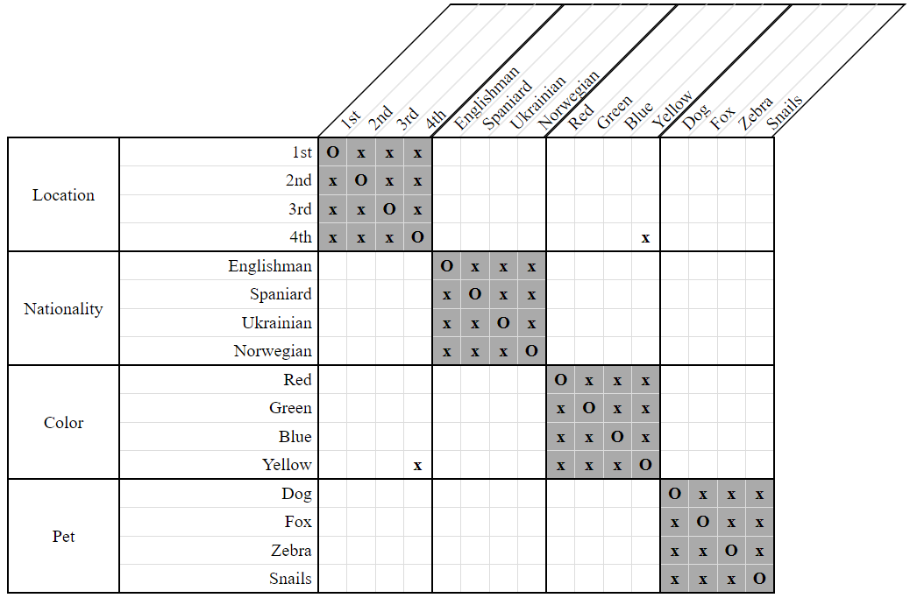
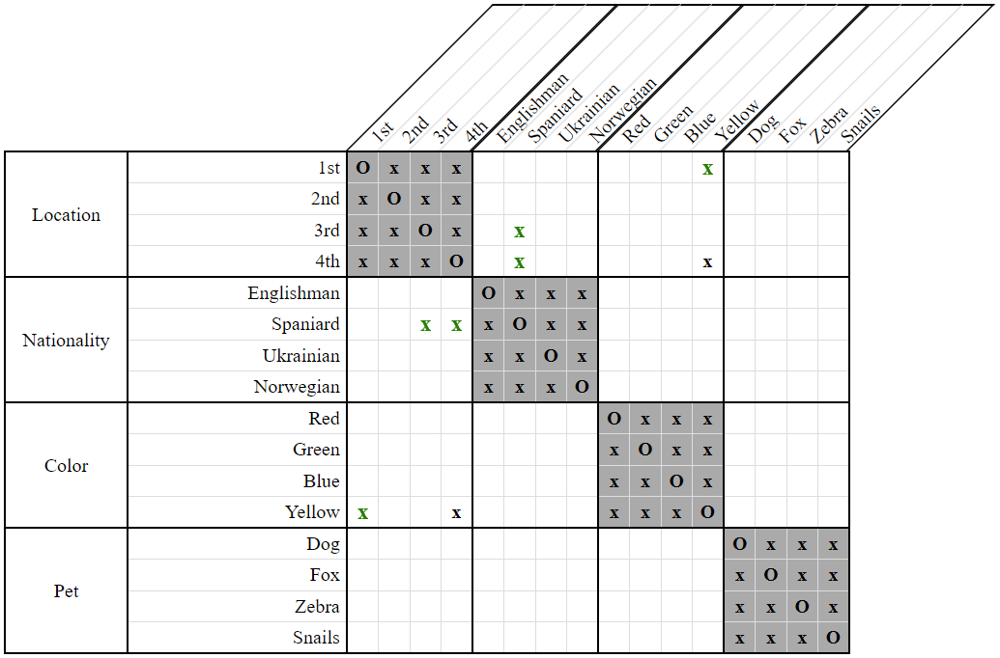

# LessThan Domain Strategy

The *LessThan Domain Strategy* captures the basic, intuitive meaning of `LessThan` constraints.

Specifically, when we're given `LessThan(X, Y)`, we disassociate from `X` any positions which are greater than or equal to the greatest position of `Y`. Similarly, we disassociate from `Y` any positions which are less than or equal to the least position of `X`.

As an example, consider the following clue and grid:

- The Spaniard lives somewhere to the left of the yellow house.  
    `LessThan(Spaniard, Yellow)`
    
  
**Figure 1**

In this grid, we see that the greatest possible position / rightmost possible location of the yellow house is `3rd`. Since the Spaniard lives somewhere to the left of the yellow house, he cannot live at either the `3rd` or `4th` locations.

Similarly, we see that the least possible position / leftmost possible location of the Spaniard is `1st`. Since the yellow house is positioned somewhere to the right of the Spaniard's, it cannot be placed at the `1st` location.

  
**Figure 2**

