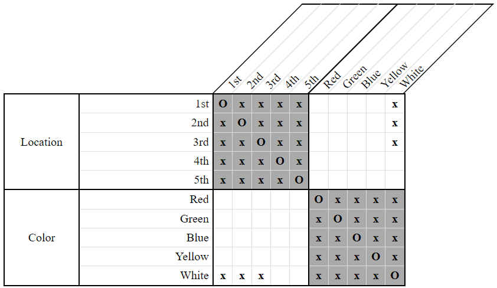
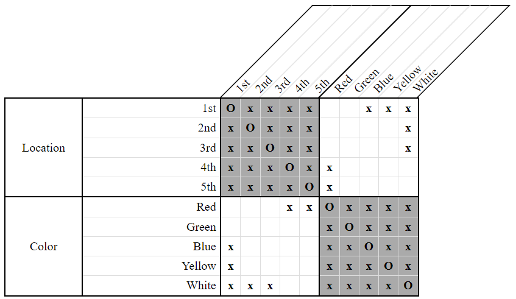
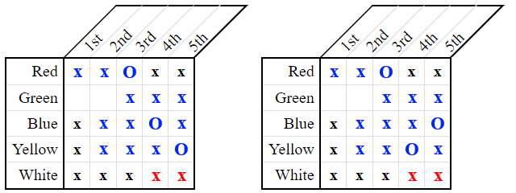
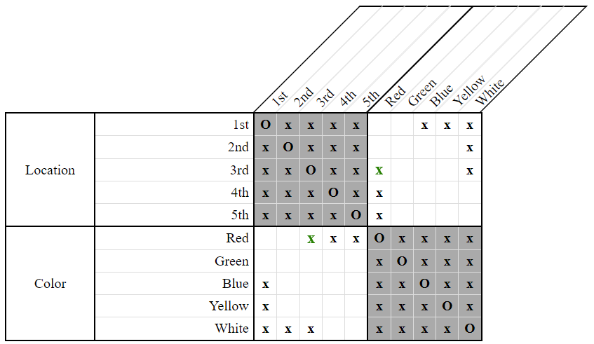
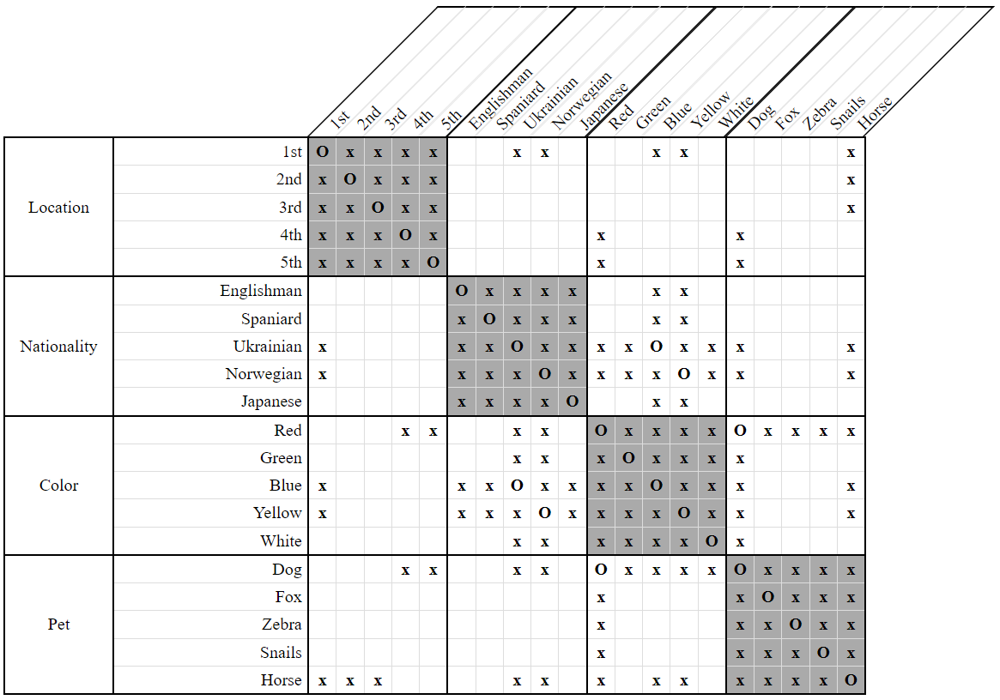
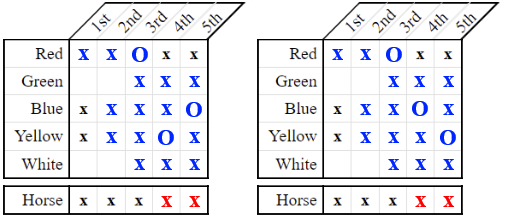
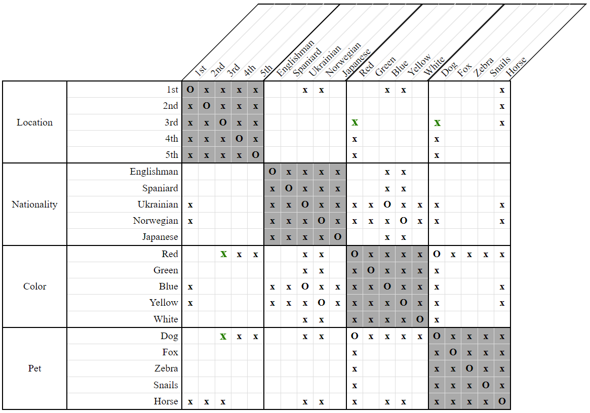

# LessThan Many Compatibility Check Strategy

The *compatibility check* strategies are among the most difficult ones to use, but they are all based on the same general idea. Given two properties `X` and `Y`, we look at all the different combinations of positions that could be assigned to them. For each combination, we check whether it would cause another property `Z` to have no positions left available to it. If such a property `Z` exists, we disassociate the corresponding combination of positions from the properties `X` and/or `Y`.

The main difference between these strategies are the types of constraints examined, since they dictate which combinations of positions need to be considered. The *LessThan Many Compatibility Check Strategy* specifically looks at constraints of the form `LessThan(X, Y1) & LessThan(X, Y2) & ... & LessThan(X, Yn)`.

This is a rather subtle strategy which applies mostly to larger puzzles - those having a category size 5 or higher. With smaller puzzles, other simpler strategies tend to produce the same results. 

Consider the following clue and grid:

- The red house is located somewhere to the left of both the blue house and the yellow house.  
    `LessThan(Red, Blue) & LessThan(Red, Yellow)`
    
  
**Figure 1**

Since the red house comes before two others, we can eliminate its `4th` and `5th` positions immediately. We can also eliminate the `1st` position from both the blue and yellow houses.

  
**Figure 2**

So far, these are just the same deductions that the [LessThan Many Domain Strategy](LessThanManyDomainStrategy.md) would make. We can do better.

What would happen if we tried to put the red house into the `3rd` position? This would force the yellow and blue houses into the `4th` and `5th` positions, creating a slight problem.

  
**Figure 3**

No space would be available for the white house! Although `4th` and `5th` are indeed both valid positions for the blue and yellow houses, we must save one of them for the white house.

Therefore, the red house cannot go into the `3rd` position.

  
**Figure 4**

The above example illustrates only the simpler variant of this strategy, covering just a single category. It is possible to generalize over multiple categories as the following example shows.

Consider the following clues and grid:

- The red house is located somewhere to the left of the Ukrainian.  
    `LessThan(Red, Ukrainian)`
    
- The man who keeps the dog lives somewhere to the left of the Norwegian.  
    `LessThan(Dog, Norwegian)`
    
  
**Figure 5**

This is a prime example of the importance of "normalizing" our constraints - that is, of rewriting our clues so that they span as few categories as possible for the sake of simplifying them. As currently written, it's difficult to glean much new information.

Notice that the man who owns the dog is the same person who lives in the red house. Furthermore, the Ukrainian is the same person who lives in the blue house, and the Norwegian is the same person who lives in the yellow house.

Thus, our clues can be rewritten in a simpler way without losing any of their meaning:

- The red house is located somewhere to the left of the Ukrainian (blue house owner).  
    `LessThan(Red, Blue)`
    
- The man who keeps the dog (red house owner) is located somewhere to the left of the Norwegian (yellow house owner).  
    `LessThan(Red, Yellow)`
    
In short, the owner of the red house lives to the left of two other people. The rightmost available locations for the blue and yellow houses are `4th` and `5th`. This begs the question - can we put the red house into the `3rd` location?

At first glance it may seem like we could, but we'll run into a problem if we try.

  
**Figure 6**

It was given beforehand that the horse owner cannot go in either the `1st`, `2nd`, or `3rd` locations. In addition, the horse owner lives neither in the red house, nor in the blue house, nor in the yellow house - he's a whole other distinct person. 

Attempting to push the blue and yellow houses into the `4th` and `5th` locations would leave the horse owner with nowhere to live. Therefore, just as with our first example, the red house cannot be the `3rd` one.

  
**Figure 7**

## Variants

The above examples have illustrated two different variants of the *LessThan Many Compatibility Check Strategy* - one that only operates over a single category, and one that can operate over many categories. These variants are, respectively, called:

- SameCategory
- General

All of the *compatibility check* strategies have only these two variants. 
