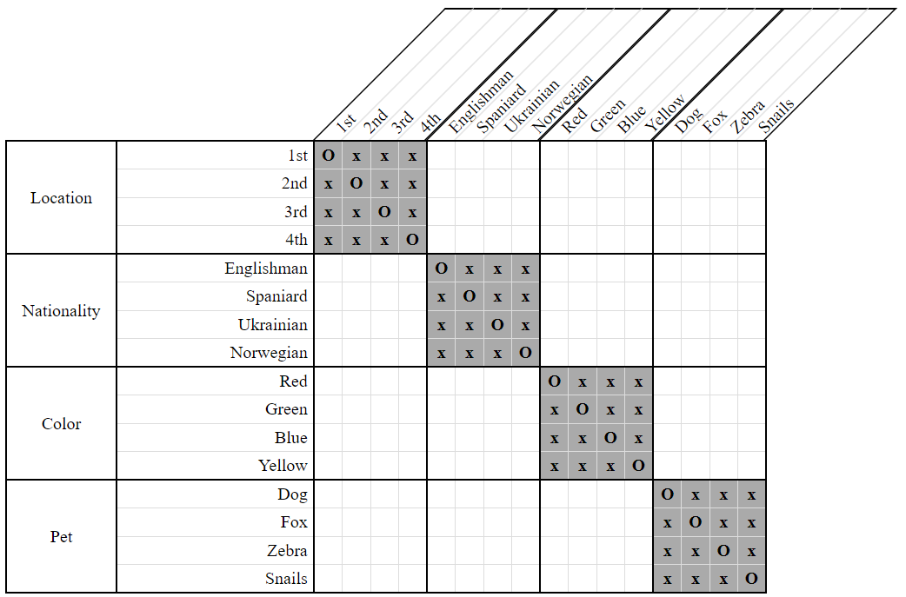
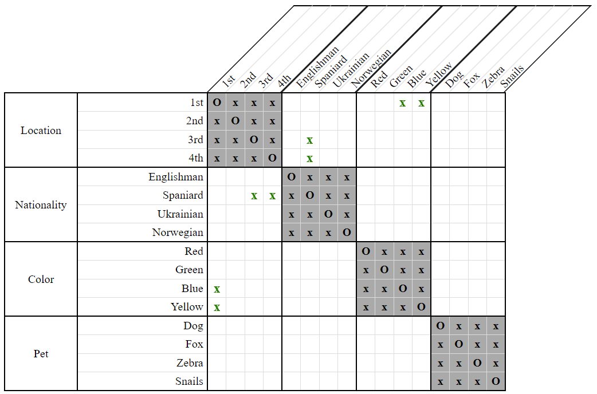
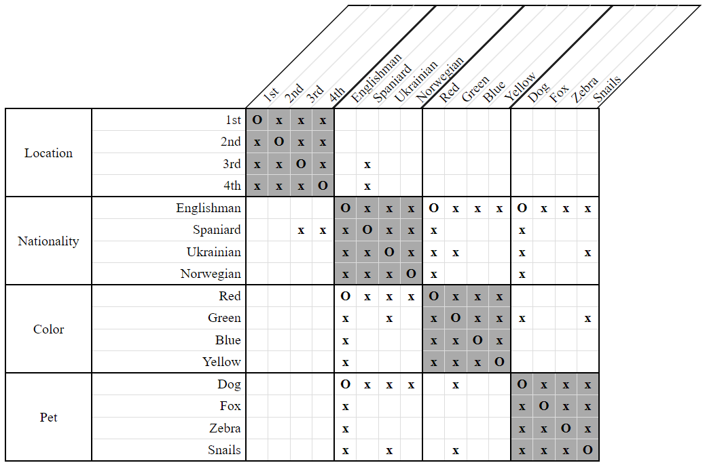
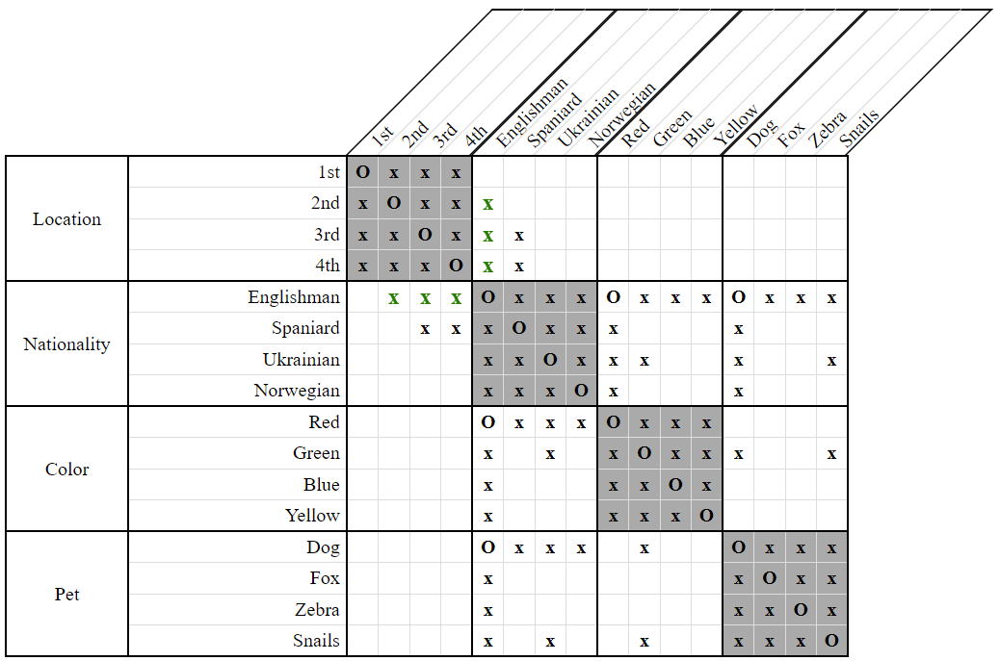

# LessThan Many Domain Strategy

The *LessThan Many Domain Strategy* is a generalization of the *LessThan Domain Strategy* and captures what it means for something to be "less than" or to "come before" many other distinct things.

Specifically, if we're given many `LessThan` constraints of the form `LessThan(X, Y1) & LessThan(X, Y2) & LessThan(X, Y3) & ... & LessThan(X, YN)`, we disassociate from `X` any positions which are greater than or equal to the *N* greatest positions still available to `Y1`, `Y2`, ... `YN`.

As an example, consider the following clues and grid:

- The Spaniard lives somewhere to the left of the yellow house.  
    `LessThan(Spaniard, Yellow)`

- The Spaniard lives somewhere to the left of the blue house.  
    `LessThan(Spaniard, Blue)`

  
**Figure 1**

There are two distinct things that the Spaniard lives to the left of - the blue house and the yellow house. Thus, we can disassociate from the Spaniard the last two available locations of the blue and yellow houses - namely, `3rd` and `4th`.

  
**Figure 2**

We've also eliminated here the `1st` location from both the yellow and blue houses. While *LessThan Many Domain* is capable of making this deduction, the plain [LessThan Domain Strategy](LessThanDomainStrategy.md) would normally have done it instead since it usually gets applied first.

Let's explore a more complex example. Consider the following clues and grid:

- The Englishman lives somewhere to the left of the man who keeps snails.  
    `LessThan(Englishman, Snails)`
    
- The owner of the red house lives somewhere to the left of the Ukrainian.  
    `LessThan(Red, Ukrainian)`
    
- The man who owns the dog lives somewhere to the left of the green house.  
    `LessThan(Dog, Green)`
    
  
**Figure 3**

The important thing to notice here is that the Englishman, the man living in the red house, and the dog owner are all the same person! By contrast, the Ukrainian, the man living in the green house, and the man who keeps snails are all different people.

This means there are three distinct people that the Englishman lives to the left of. Thus, we can disassociate from him the last three locations available to those people - namely, *2nd*, *3rd*, and *4th*.

  
**Figure 4**

This, of course, leaves the Englishman living in the *1st* house, which in turn forces the Spaniard into the *2nd* house, but I'll leave the rest of the deductions for you.

## Variants

Because the *LessThan Many Domain Strategy* involves looking at several constraints together, it's not always easy to recognize which constraints might apply. Given `LessThan(Spaniard, Yellow) & LessThan(Spaniard, Blue)`, it's plainly obvious that the Spaniard lives somewhere to the left of two other people. However, given `LessThan(Englishman, Snails) & LessThan(Red, Ukrainian) & LessThan(Dog, Green)` it is significantly more difficult to recognize that the Englishman lives to the left of three other people.

Listed below are the four variants of this strategy in order of increasing difficulty. The primary difference between them is the technique used to select which constraints to consider. 

- Direct
    
    This variant considers only constraints of the form `LessThan(X, A1) & LessThan(X, A2) & LessThan(X, A3) & ...` where `A1`, `A2`, `A3`, etc... are all properties within the same category. It is the one illustrated in our first example with `LessThan(Spaniard, Yellow) & LessThan(Spaniard, Blue)`. 

- Indirect / Equal Only

    This variant considers constraints of the form `LessThan(X, A1) & LessThan(Y, A2) & LessThan(Z, A3) & ...`, where `A1`, `A2`, `A3`, etc... are all properties within the same category, but where `X`, `Y`, `Z`, etc... are all associated properties spanning multiple categories.
    
    An example of the constraints considered would be `LessThan(Englishman, Snails) & LessThan(Red, Zebra) & LessThan(Dog, Fox)`, where `Englishman`, `Red`, and `Dog` are all associated and so refer to the same person.
    
- Indirect / Distinct Only

    This variant considers constraints of the form `LessThan(X, A) & LessThan(X, B) & LessThan(X, C) & ...`, where `A`, `B`, `C`, etc... are all disassociated properties spanning multiple categories.

    An example of the constraints considered would be `LessThan(Englishman, Snails) & LessThan(Englishman, Ukrainian) & LessThan(Englishman, Green)`, where `Snails`, `Ukrainian` and `Green` are all disassociated from each other and so refer to distinct people.

- Indirect / Both

    This variant is a combination of *Equal Only* and *Distinct Only*. It considers constraints of the form `LessThan(X, A) & LessThan(Y, B) & LessThan(Z, C) & ...` where `X`, `Y`, `Z`, etc.. are all associated properties spanning multiple categories, and `A`, `B`, `C`, etc... are all disassociated properties spanning multiple categories. It is the one illustrated in our second example with `LessThan(Englishman, Snails)`, `LessThan(Red, Ukrainian)`, `LessThan(Dog, Green)`.

## Greater Than Many  

If we can deduce that the Englishman lives to the left of three distinct people, shouldn't we also be able to deduce, say, that the Norwegian lives to the right of three distinct people given similar constraints?

*LogikGen*'s implementation of the *LessThan Many Domain Strategy* does indeed automatically apply itself to the symmetric case of one person living to the right of many others. It is not a separate variant, nor a separate strategy. 