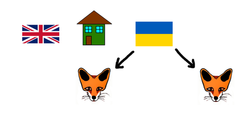

# Generation Strategies 

Not all important information can be recorded on the grid. With particularly challenging puzzles, it can sometimes be helpful to write down our deductions as additional clues to which we can apply our other strategies.

This is the purpose of the *constraint generation* strategies. They take the existing constraints of our puzzle and transform them into different, albeit equivalent constraints that other strategies might be able to make better use of. 

*LogikGen* currently has three such strategies: [LessThan Transitive Constraint Generation](LessThanTransitiveConstraintGenerationStrategy.md), [EitherOr Transitive Constraint Generation](EitherOrTransitiveConstraintGenerationStrategy.md), and [LessThan/NextTo Transitive Constraint Generation](LessThanNextToTransitiveConstraintGenerationStrategy.md).

## LessThan/NextTo Transitive Constraint Generation Strategy

Whenever we have three constraints of the form `LessThan(X, A) & LessThan(A, B) & NextTo(Y, B)`, then we can immediately conclude `LessThan(X, Y)`. As an example, consider the clues:

- The Englishman lives to the left of the green house.  
    `LessThan(Englishman, Green)`
    
- The green house is to the left of the Ukrainian.  
    `LessThan(Green, Ukrainian)`
    
- The man who keeps foxes lives next to the Ukrainian  
    `NextTo(Fox, Ukrainian)`
    
We can visualize these constraints like so:

  
**Figure 1**

Since the man who keeps foxes lives next to the Ukrainian, while the Englishman lives far to the left of the Ukrainian, we can conclude:

- The Englishman lives to the left of the man who keeps foxes.  
    `LessThan(Englishman, Fox)`
    
Other *LogikGen* strategies will then be able to make use of this new clue.

### Variants

There are two variants of the *LessThan/NextTo Transitive Constraint Generation Strategy*, differing only by how the three initial constraints are matched up.

- Direct  

    The example above illustrates only the easier, albeit less powerful *Direct* variant which recognizes only constraints of the form `LessThan(X, A) & LessThan(A, B) & NextTo(Y, B)`.

- Indirect (Equal Only)

    The more powerful, but more difficult variant is able to recognize constraints of the form `LessThan(X, A1) & LessThan(A2, B1) & NextTo(Y, B2)` where `A1` is associated with `A2` and `B1` is associated with `B2`. As an example, consider the clues:
    
    - The Englishman lives to the left of the green house.  
        `LessThan(Englishman, Green)`
        
    - The man who drinks tea lives to the left Ukrainian.  
        `LessThan(Tea, Ukrainian)`
        
    - The man who keeps foxes lives next to the man who keeps the zebra.  
        `NextTo(Fox, Zebra)`
        
    If it is known that the man in the green house is the one who drinks tea, and that the Ukrainian is the one who keeps the zebra, then we can conclude:
    
    - The Englishman lives to the left of the man who keeps foxes.  
        `LessThan(Englishman, Fox)`
        
    