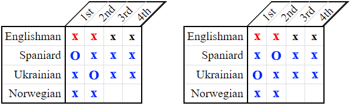
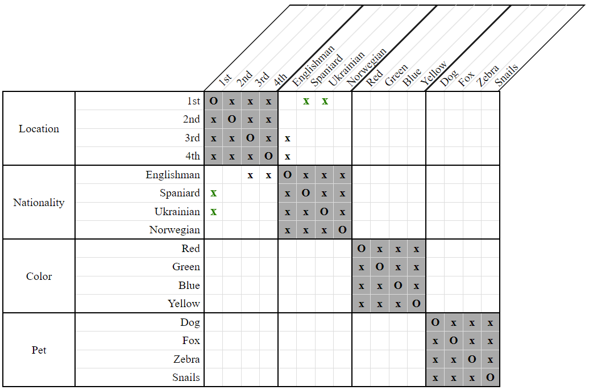
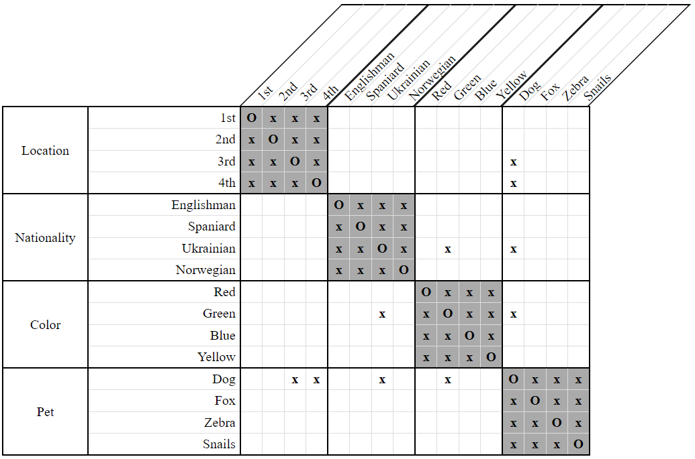
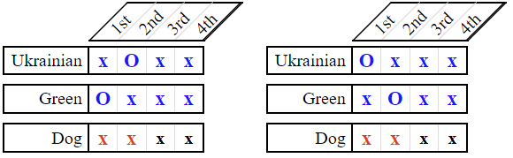
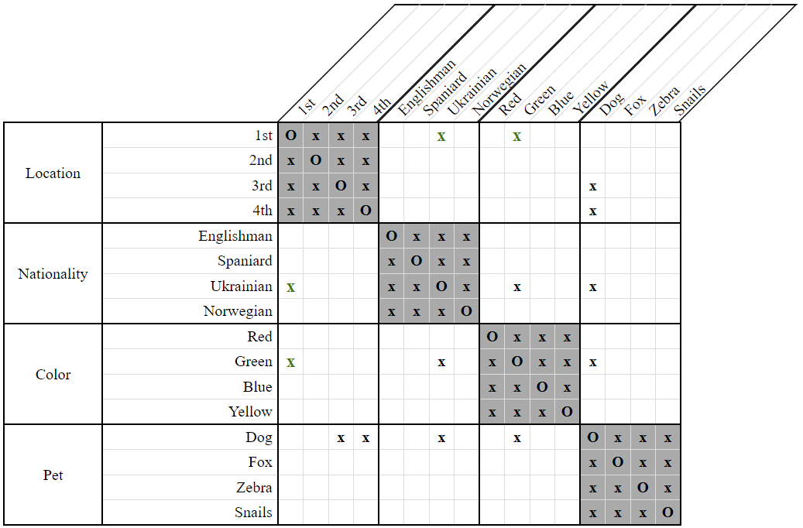

# NextTo Compatibility Check Strategy

The *compatibility check* strategies are among the most difficult ones to use, but they are all based on the same general idea. Given two properties `X` and `Y`, we look at all the different combinations of positions that could be assigned to them. For each combination, we check whether it would cause another property `Z` to have no positions left available to it. If such a property `Z` exists, we disassociate the corresponding combination of positions from the properties `X` and/or `Y`.

The main difference between these strategies are the types of constraints examined, since they dictate which combinations of positions need to be considered. The *NextTo Compatibility Check Strategy* is a generalization of the *Immediate LessThan Compatibility Check Strategy* and looks specifically at constraints of the form `NextTo(X, Y)`.

Consider the following clue and grid:

- The Ukrainian lives next to the Spaniard.  
    `NextTo(Ukrainian, Spaniard)`
    
  
**Figure 1**

We have many choices of locations in which to place the Ukrainian and Spaniard. Some of these choices, however, lead to the problem shown below.

  
**Figure 2**

If we place one of these people into the `1st` house, that forces the other into the `2nd` house since they must live next to each other. However, this would leave no positions left for the Englishman!

Therefore, we may conclude that neither the Ukrainian nor the Spaniard can live in the `1st` house.

  
**Figure 3**

The above example illustrates only the simpler variant of this strategy, covering just a single category. It is possible to generalize over multiple categories as the following example shows.

Consider the following clue and grid:

- The Ukrainian lives next to the green house.  
    `NextTo(Ukrainian, Green)`

  
**Figure 4**

The important thing to note here is that the dog belongs to neither the Ukrainian, nor to the person who lives in the green house. 

We have many choices of locations in which to place the Ukrainian and the green house but some of these choices lead to the same type of problem as before.

  
**Figure 5**

If we place either the Ukrainian or the green house into the `1st` position, that forces the other into the `2nd` position since they must be next to each other. However, this would leave no positions left for the dog!

Therefore, we may conclude that neither the Ukrainian nor the owner of the green house live in the `1st` position.

  
**Figure 6**

## Variants

The above examples have illustrated two different variants of the *NextTo Compatibility Check Strategy* - one that only operates over a single category, and one that can operate over many categories. These variants are, respectively, called:

- SameCategory
- General

All of the *compatibility check* strategies have only these two variants. 
