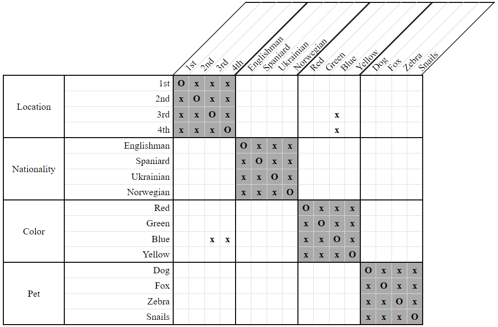
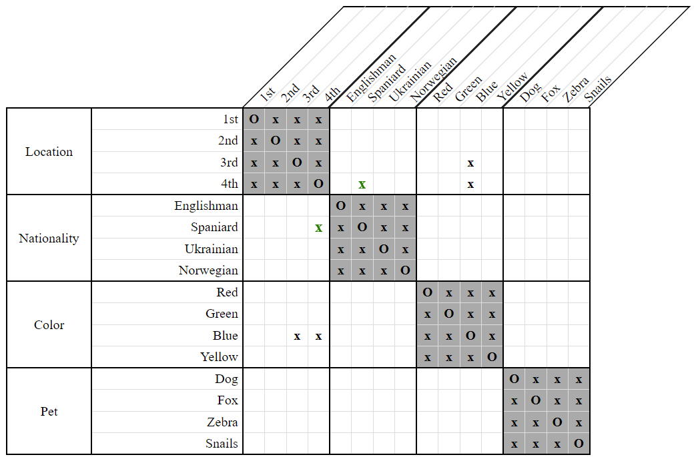

# NextTo Domain Strategy

The *NextTo Domain Strategy* captures the basic, intuitive meaning of *NextTo* constraints.

Specifically, when we're given `NextTo(X, Y)`, we disassociate from `X` those positions which are not adjacent to any of the available positions for `Y`. Similarly, we disassociate from `Y` those positions which are not adjacent to any of the available positions for `X`.

As an example, consider the following clue and grid:

- The Spaniard lives next to the blue house.  
    `NextTo(Spaniard, Blue)`
    
  
**Figure 1**

In this grid, we see that the only available positions for the blue house are `1st` and `2nd`. The Spaniard cannot live in the `4th` house, because then he couldn't be adjacent to the blue house.

Therefore, we can disassociate the `4th` position from the Spaniard.

  
**Figure 2**

