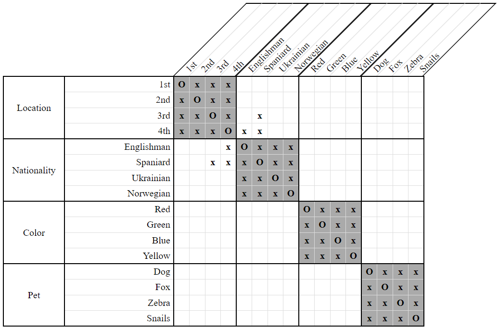
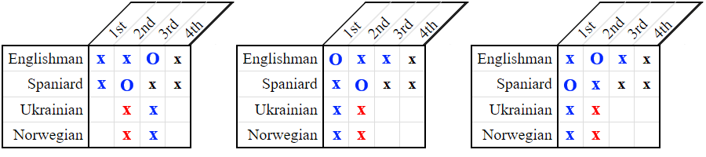
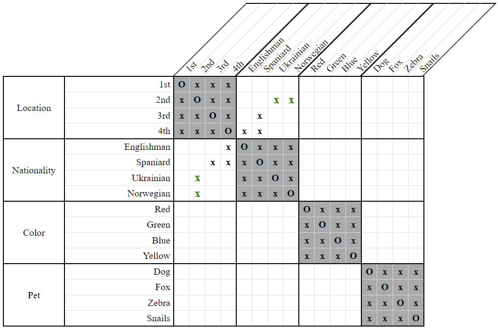
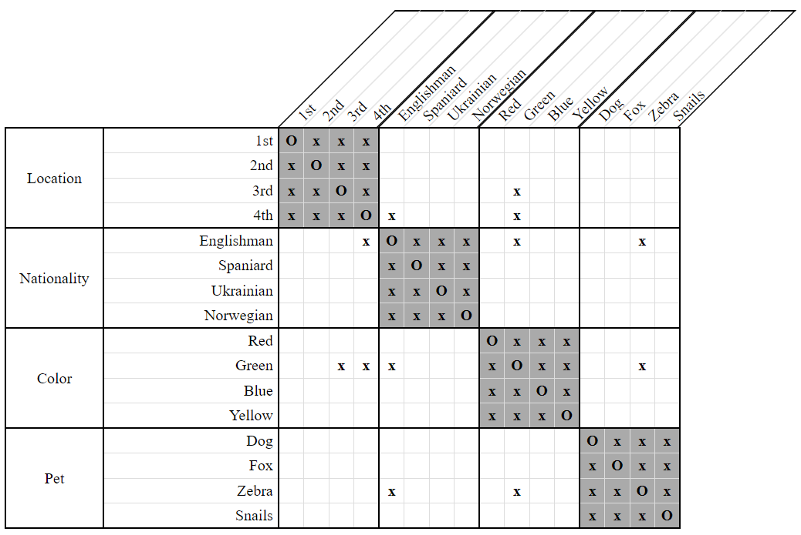
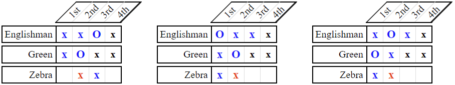

# NextTo Incompatibility Search Strategy

The *compatibility check* strategies are among the most difficult ones to use, but they are all based on the same general idea. Given two properties `X` and `Y`, we look at all the different combinations of positions that could be assigned to them. For each combination, we check whether it would cause another property `Z` to have no positions left available to it. If such a property `Z` exists, we disassociate the corresponding combination of positions from the properties `X` and/or `Y`.

*NextTo Incompatibility Search* is, in some respects, the opposite of [NextTo Compatibility Check](NextToCompatibilityCheckStrategy.md). 

Given a constraint `NextTo(X, Y)`, *NextTo Compatibility Check* will consider every combination of positions for `X` and `Y` and then eliminate those combinations which conflict with the available positions for some other property `Z`.

*NextTo Incompatibility Search*, by contrast, will disassociate from `Z` any positions which conflict with all possible combinations of positions for `X` and `Y`.

Consider the following clue and grid:

- The Englishman lives next to the Spaniard.  
    `NextTo(Englishman, Spaniard)`
    
  
**Figure 1**

We have many choices of locations in which to place the Englishman and Spaniard. All of them, however, have something in common.

  
**Figure 2**

No matter which choice we make, we always eliminate the `2nd` location from both the Ukrainian and Norwegian! We can therefore conclude that neither the Ukrainian nor the Norwegian could possibly live in the `2nd` location.

  
**Figure 3**

The above example illustrates only the simpler variant of this strategy, covering just a single category. It is possible to generalize over multiple categories as the following example shows.

Consider the following clue and grid:

- The Englishman lives next to the green house.  
    `NextTo(Englishman, Green)`
    
  
**Figure 4**

The important thing to note here is that the zebra belongs neither to the Englishman, nor to the person who lives in the green house.

Like before, we have many choices of locations in which to place the Englishman and the green house. Once again, all of them have something in common. 

  
**Figure 5**

No matter which choice we make, we always eliminate the `2nd` location for the zebra! We can therefore conclude that the zebra can't possibly live in the `2nd` location.

  
**Figure 6**

## Variants

The above examples have illustrated two different variants of the *NextTo Incompatibility Search Strategy* - one that only operates over a single category, and one that can operate over many categories. These variants are, respectively, called:

- SameCategory
- General

All of the *compatibility check* strategies have only these two variants. 

