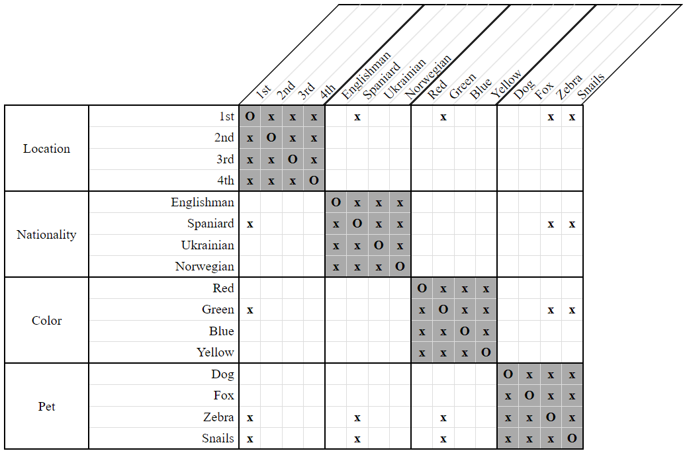
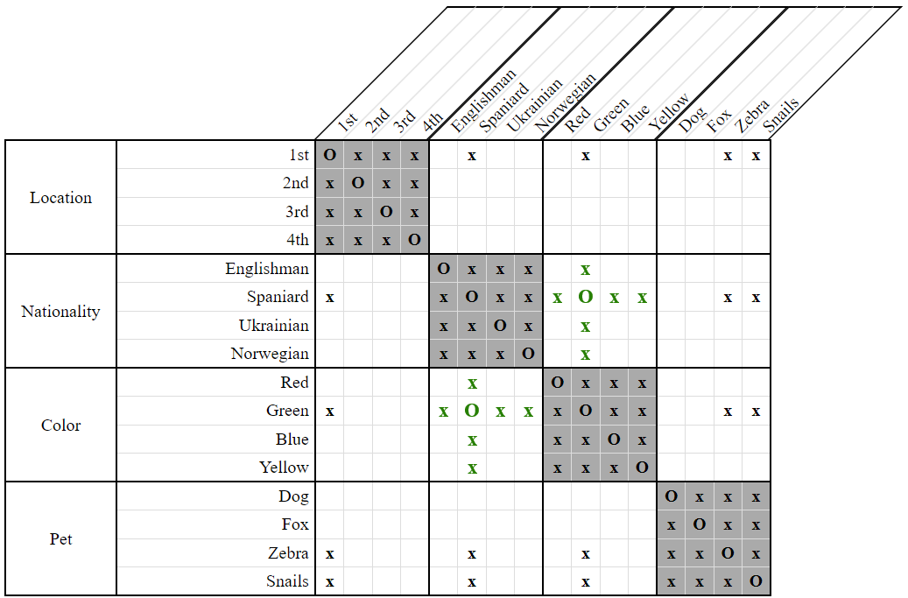

# Pigeonhole Strategy

*Pigeonhole* is one of the more unusual strategies employed when solving logic puzzles. Based on the famous [pigeonhole principle](https://en.wikipedia.org/wiki/Pigeonhole_principle) in mathematics, it is a grid-only technique for deducing an association between two properties.

To illustrate, consider the following grid:

  
**Figure 1**

Notice here that the first house, the Spaniard, and the green house all have the same two choices of pets: either the dog, or the fox.

Notice also that the first house neither belongs to the Spaniard, nor is it green. Thus, the properties *1st*, *Spaniard*, and *Green* must refer to at least two distinct people.

If the Spaniard wasn't the one who lived in the green house, then we'd be referring to three distinct people. However, there simply aren't enough available pets to go around for that. The dog and the fox cannot be split among three people.

Therefore, the Spaniard must be the one who lives in the green house.

  
**Figure 2**
