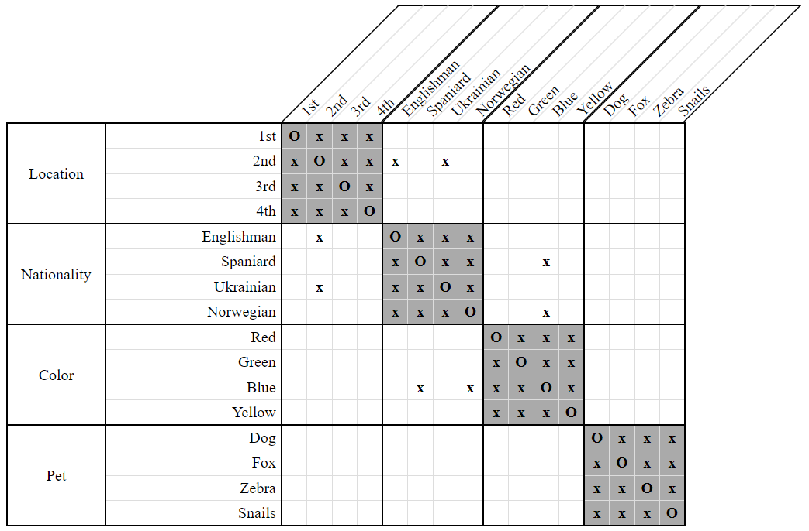
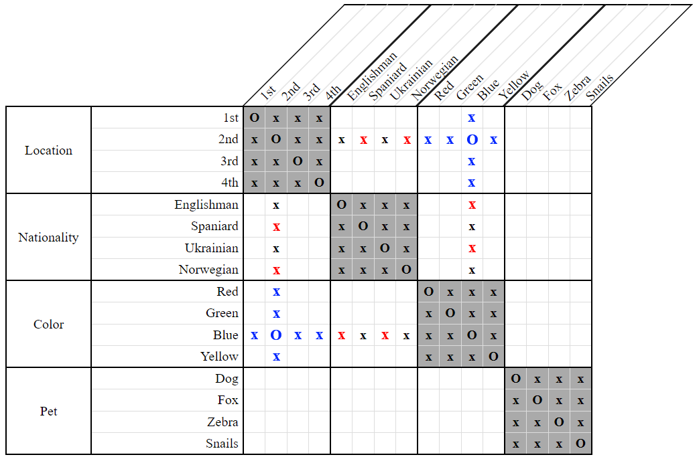
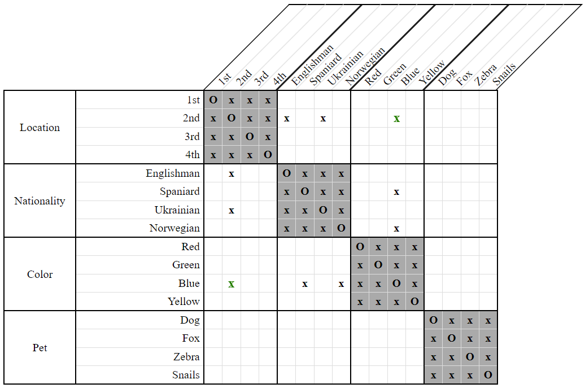

# Property Pair Analysis Strategy

*Property Pair Analysis* is a common grid-only strategy by which we examine two properties to see whether they are compatible with each other. If merging two columns together would fill an entire category with `x`'s, then the corresponding properties have to be disassociated. 

To illustrate, consider the following grid:

  
**Figure 1**

Notice that the 2nd house is associated with netiher the Englishman, nor the Ukrainian. In addition, the blue house is associated with neither the Spaniard, nor the Norwegian.

If we tried  to make the 2nd house the blue one, then nobody could own it!

  
**Figure 2**

Notice that the `Nationality` category is filled entirely with `x`s for both `2nd` and `Blue`. This situation is not allowed in Zebra puzzles. We therefore conclude that the 2nd house can't be the blue one.

  
**Figure 3**
