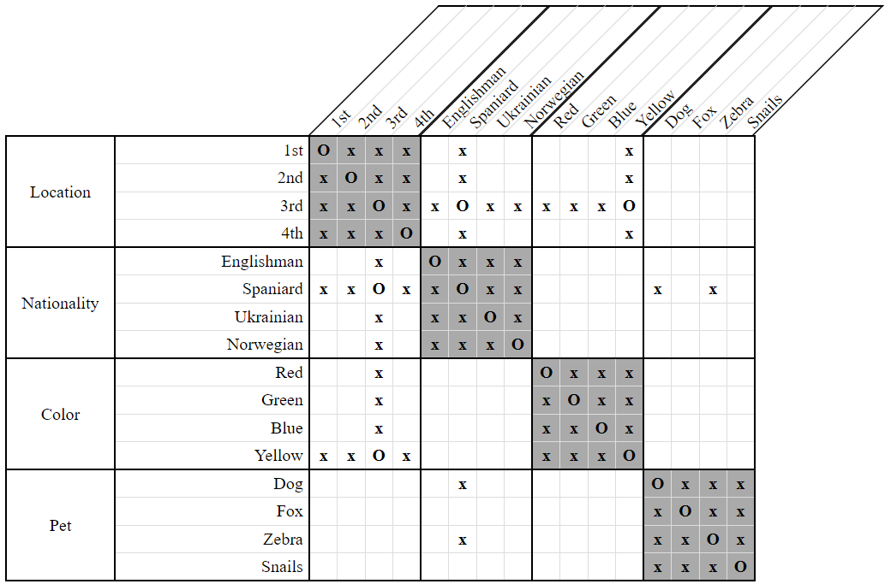
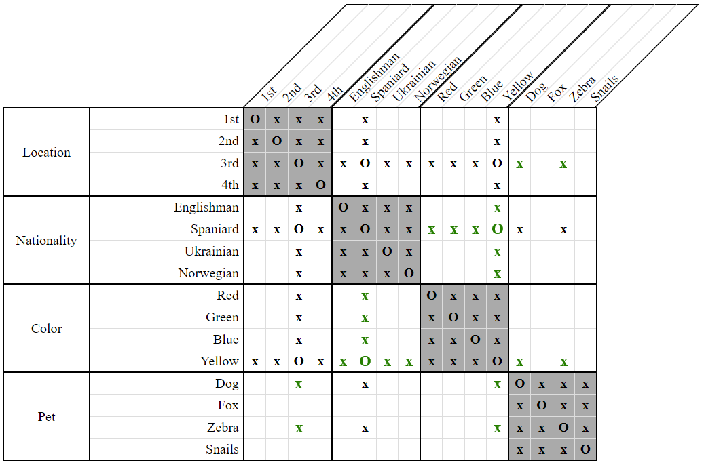

# Synchronize Strategy

*Synchronization* is an essential grid-only strategy for solving *Zebra* puzzles. It is the process of ensuring every pair of associated properties has the exact same set of relationships.

To illustrate, consider the following grid:

  
**Figure 1**

Notice that the properties *Spaniard*, *Yellow*, and *3rd* all refer to the same person, yet different information has been recorded on each. Only on *Spaniard* have we recorded disassociations with *Dog* and *Zebra*. Similarly, no relationship has been recorded between *Spaniard* and *Yellow* even though the Spaniard lives in the 3rd house and the 3rd house is yellow.

Thus, we need to synchronize everything we know about these properties - that the Spaniard lives in the 3rd yellow house, but not the dog nor the zebra. 

  
**Figure 2**

